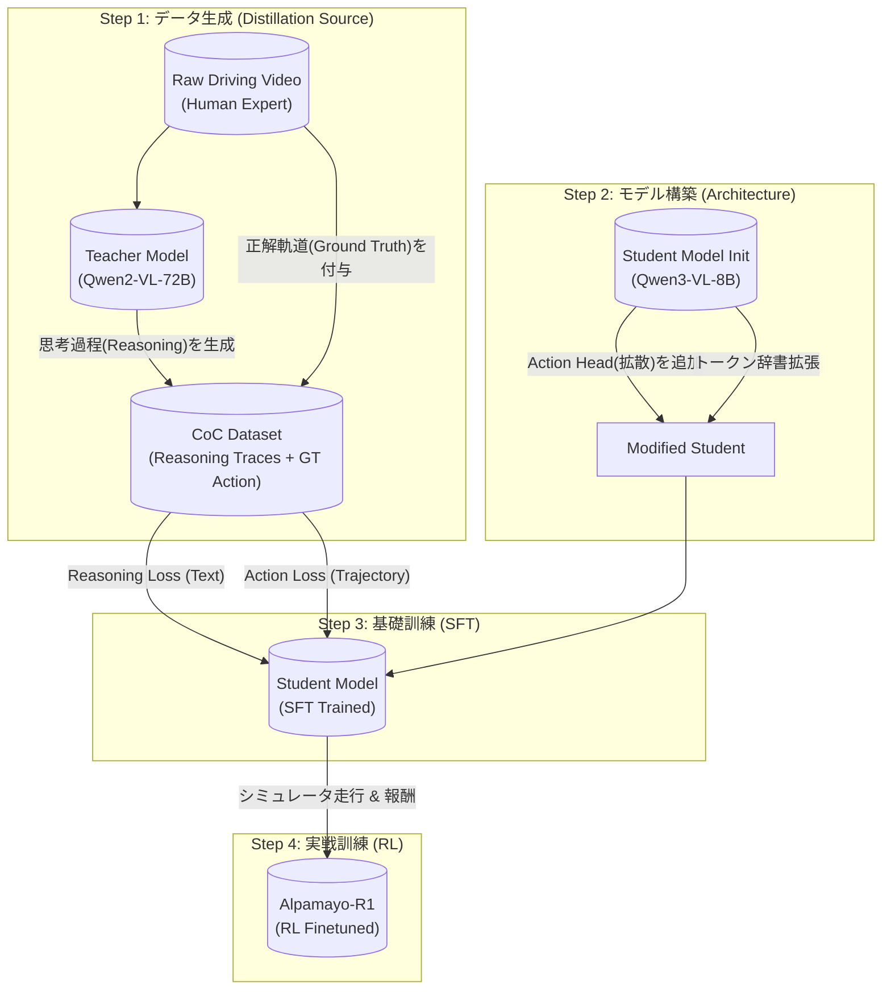

# Alpamayo-R1 の構築プロセス (Training Pipeline)

Alpamayo-R1 がどのように作られたか、Teacherモデル (Qwen-72B) と Studentモデル (Qwen3-VL-8B) の関係を中心に整理します。

論文: https://arxiv.org/html/2511.00088v2

## 全体像 (Mermaid Diagram)

---

## 各ステップの詳細

### Step 1: Teacherによる教材作り (Data Generation)
*   **主体:** `Qwen2-VL-72B` (Teacher)
*   **入力:** 生の運転動画
*   **処理:** 
    *   動画を見て「なぜその運転をするのか？」という **CoC (Chain of Causation: 因果関係の連鎖)** をテキストとして生成します。
    *   例: 「前方に歩行者がいる(感知) → 衝突のリスクがある(予測) → 減速すべきだ(判断)」
    *   **重要 (Auto-Labeling with Meta Actions):**
        *   実はTeacherにただ動画を見せるのではなく、**「答え（実際の行動）」** を先に教えています。
        *   **Meta Actions:** 車の生データ（速度・ハンドル）を、**ルールベースの単純なプログラム (Rule-based Detectors)** で「減速した」「左に切った」などの単語に自動変換します。AIなどの推論は使いません。
            > "we first define a set of low-level meta actions and implement corresponding rule-based detectors to infer these meta actions at the frame level." (arXiv:2511.00088v2, Section 4.3.2)
        *   **命令:** 「車はこういう行動（Meta Actions）をした。その理由を動画から説明せよ」とTeacherに解かせます。これにより行動と矛盾しない思考が生成されます。
*   **出力:** `[動画, 思考テキスト(CoC), 正解軌道(GT)]` のセットになったデータセット。
    *   ※正解軌道は人間が運転した記録(Ground Truth)そのものです。
    *   **検証 (Consistency Filtering):** それでもおかしな思考（幻覚）が出た場合はフィルタリングで弾きます。
        1.  **ルールベース:** 「赤信号」「衝突」などのキーワードが含まれるのに、GTが減速していない場合はNG。
        2.  **Model-Based Verification:** 生成された思考テキストを別のAIに検証させます。
            *   **Criticの正体:** 論文では **DeepSeek-R1** や **Cosmos-Reason** (の強力なバージョン) などの **LRM (Large Reasoning Model)** がこの試験官役として使われています。
            > "we leverage state-of-the-art LRMs (e.g., DeepSeek-R1 (DeepSeek-AI, 2025), Cosmos-Reason (NVIDIA et al., 2025a)) as reasoning critics to evaluate the quality of reasoning traces generated by the VLA." (arXiv:2511.00088v2, Section 5.3)

### Step 2: Studentの改造 (Feature Expansion)
*   **主体:** `Qwen3-VL-8B` (Student)
*   **処理:** 
    *   これ自体は市販のモデルですが、Alpamayo用に **「Trajectory Decoder (手足)」** を接合します。
    *   さらに、手足を動かすための **「Trajectory Tokens (<i0>...)」** を辞書に追加します。
    *   *この時点ではまだ脳と手足が繋がっていないため、動きません。*

### Step 3: 基礎訓練 (Supervised Fine-Tuning)
*   **目的:** Teacherの思考と、人間の運転操作をコピーする。
*   **学習内容 (Multi-task Learning):**
    1.  **Thinking (Next Token Prediction):** Teacherが作った「思考テキスト」を予測できるようにする (Loss: Cross Entropy)。
    2.  **Acting (Flow Matching / Diffusion):** 人間の「正解軌道(GT)」と同じ軌道を出せるようにする (Loss: MSE/Flow Match)。
*   **結果:** 「歩行者がいるから止まる」と考えながら、正しいブレーキ操作ができるモデルになります。

### Step 4: 実戦訓練 (Reinforcement Learning)
*   **目的:** コピー学習(SFT)の限界を超える。
*   **処理:** 
    *   実際にシミュレータ内で走らせる。
    *   「思考と行動が矛盾していないか」「安全に走れたか」を評価(Reward)し、モデルを更新する。
    *   **重要 (Consistency Reward):** 特にStep 3で生じたかもしれない「思考と行動のズレ」を、ここで徹底的に矯正します。「正しい理由を述べて、正しい行動をした時」だけ高い報酬を与えることで、言行一致させます。
        *   **仕組み (Rubric Grading):** LRM Critic (DeepSeek-R1等) が、以下の2点で採点（スカラー値 `r_reason` を算出）します。
            1.  **Behavior Consistency:** 生徒の出した「思考」は、正解の「行動(GT)」と矛盾していないか？
            2.  **Causal Reasoning Quality:** その思考は、CoCの原則（原因と結果）に従っているか？
            > "The critic evaluates how well Reason_pred aligns with Reason_GT along two dimensions: behavior consistency, whether the predicted reasoning describes a driving decision consistent with ground truth; and causal reasoning quality, whether it correctly identifies causal factors observable in the scene’s history according to CoC principles" (arXiv:2511.00088v2, Section 5.3)
        *   この点数が低いと、たとえ運転がうまくても報酬が減らされます。
*   **結果:** 未知の状況でも、思考と行動が一貫した頑健なモデル **「Alpamayo-R1」** が完成します。
