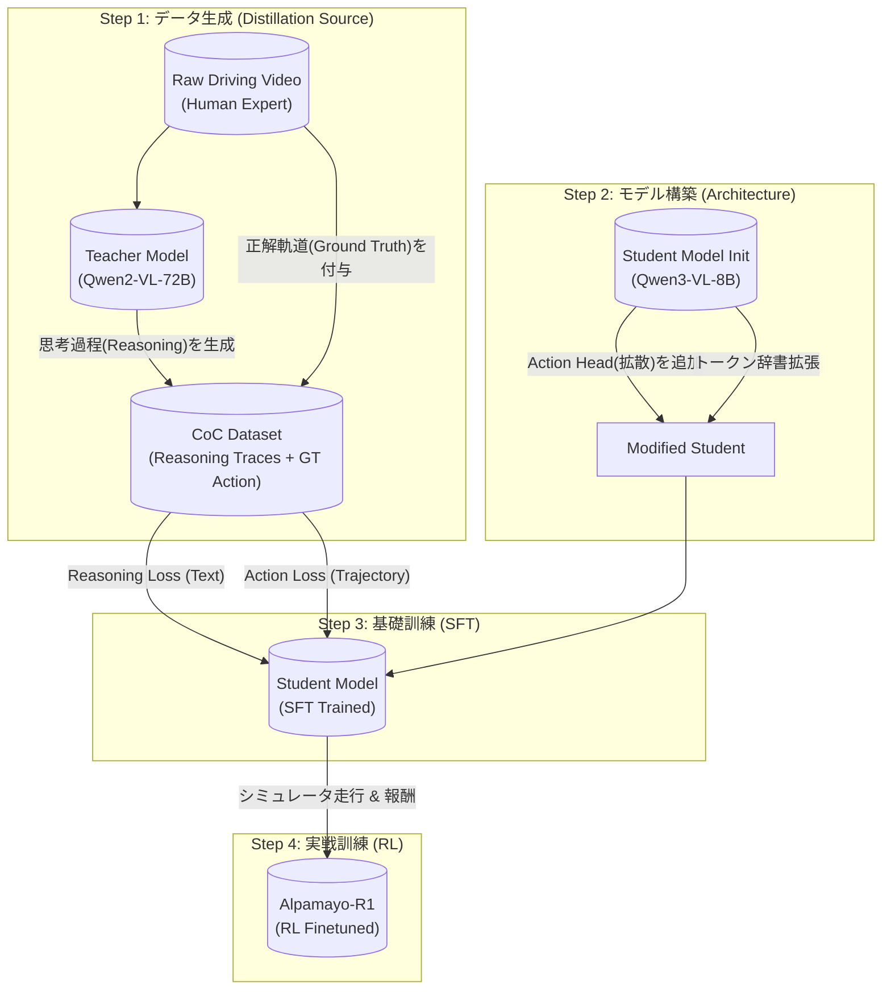

# Alpamayo-R1 の構築プロセス (Training Pipeline)

Alpamayo-R1 がどのように作られたか、Teacherモデル (Qwen-72B) と Studentモデル (Qwen3-VL-8B) の関係を中心に整理します。

論文: https://arxiv.org/html/2511.00088v2

## 全体像 (Mermaid Diagram)

---

## 各ステップの詳細

### Step 1: Teacherによる教材作り (Data Generation)
*   **主体:** `Qwen2-VL-72B` (Teacher)
*   **入力:** 生の運転動画
*   **処理:** 
    *   動画を見て「なぜその運転をするのか？」という **CoC (Chain of Causation: 因果関係の連鎖)** をテキストとして生成します。
    *   例: 「前方に歩行者がいる(感知) → 衝突のリスクがある(予測) → 減速すべきだ(判断)」
    *   **重要 (Auto-Labeling with Meta Actions):**
        *   実はTeacherにただ動画を見せるのではなく、**「答え（実際の行動）」** を先に教えています。
        *   **Meta Actions:** 車の生データ（速度・ハンドル）を、**ルールベースの単純なプログラム (Rule-based Detectors)** で「減速した」「左に切った」などの単語に自動変換します。AIなどの推論は使いません。
            > "we first define a set of low-level meta actions and implement corresponding rule-based detectors to infer these meta actions at the frame level." (arXiv:2511.00088v2, Section 4.3.2)
        *   **命令:** 「車はこういう行動（Meta Actions）をした。その理由を動画から説明せよ」とTeacherに解かせます。これにより行動と矛盾しない思考が生成されます。
*   **出力:** `[動画, 思考テキスト(CoC), 正解軌道(GT)]` のセットになったデータセット。
    *   ※正解軌道は人間が運転した記録(Ground Truth)そのものです。
    *   **検証 (Consistency Filtering):** それでもおかしな思考（幻覚）が出た場合はフィルタリングで弾きます。
        1.  **ルールベース:** 「赤信号」「衝突」などのキーワードが含まれるのに、GTが減速していない場合はNG。
        2.  **Model-Based Verification:** 生成された思考テキストを別のAIに検証させます。
            *   **Criticの正体:** 論文では **DeepSeek-R1** や **Cosmos-Reason** (の強力なバージョン) などの **LRM (Large Reasoning Model)** がこの試験官役として使われています。
            > "we leverage state-of-the-art LRMs (e.g., DeepSeek-R1 (DeepSeek-AI, 2025), Cosmos-Reason (NVIDIA et al., 2025a)) as reasoning critics to evaluate the quality of reasoning traces generated by the VLA." (arXiv:2511.00088v2, Section 5.3)

### Step 2: Studentの改造 (Feature Expansion)
*   **主体:** `Cosmos-Reason 1` (Student / Backbone)
    *   ※コード上は `Qwen3-VL-8B` と互換ですが、論文(Section 3.1)によると、Alpamayoは **「Cosmos-Reason (Qwen3をPhysical AI用に事前学習させたモデル)」** を初期値として使っています。
    *   ※引用されている論文は "Cosmos-Reason1" です (arXiv:2503.15558)。
    > "We adopt Cosmos-Reason (NVIDIA et al., 2025a) as the VLM backbone for Alpamayo-R1." (arXiv:2511.00088v2, Section 3.1)
*   **処理:** 
    *   これ自体は市販のモデルですが、Alpamayo用に **「Trajectory Decoder (手足)」** を接合します。
    *   さらに、手足を動かすための **「Trajectory Tokens (<i0>...)」** を辞書に追加します。
    *   *この時点ではまだ脳と手足が繋がっていないため、動きません。*

### Step 3: 基礎訓練 (Supervised Fine-Tuning)
*   **目的:** Teacherの思考と、人間の運転操作をコピーする。
*   **学習内容 (Multi-task Learning):**
    1.  **Thinking (Next Token Prediction):** Teacherが作った「思考テキスト」を予測できるようにする (Loss: Cross Entropy)。
    2.  **Acting (Flow Matching / Diffusion):** 人間の「正解軌道(GT)」と同じ軌道を出せるようにする (Loss: MSE/Flow Match)。
*   **結果:** 「歩行者がいるから止まる」と考えながら、正しいブレーキ操作ができるモデルになります。

### Step 4: 実戦訓練 (Reinforcement Learning)
*   **目的:** コピー学習(SFT)の限界を超える。
*   **処理:** 
    *   実際にシミュレータ内で走らせる。
    *   「思考と行動が矛盾していないか」「安全に走れたか」を評価(Reward)し、モデルを更新する。
    *   **重要 (Consistency Reward):** 特にStep 3で生じたかもしれない「思考と行動のズレ」を、ここで徹底的に矯正します。「正しい理由を述べて、正しい行動をした時」だけ高い報酬を与えることで、言行一致させます。
        *   **仕組み (Rubric Grading):** LRM Critic (DeepSeek-R1等) が、以下の2点で採点（スカラー値 `r_reason` を算出）します。
            1.  **Behavior Consistency:** 生徒の出した「思考」は、正解の「行動(GT)」と矛盾していないか？
            2.  **Causal Reasoning Quality:** その思考は、CoCの原則（原因と結果）に従っているか？
            > "The critic evaluates how well Reason_pred aligns with Reason_GT along two dimensions: behavior consistency, whether the predicted reasoning describes a driving decision consistent with ground truth; and causal reasoning quality, whether it correctly identifies causal factors observable in the scene’s history according to CoC principles" (arXiv:2511.00088v2, Section 5.3)
        *   この点数が低いと、たとえ運転がうまくても報酬が減らされます。
*   **結果:** 未知の状況でも、思考と行動が一貫した頑健なモデル **「Alpamayo-R1」** が完成します。

## 補足: Cosmos Reason との関係
*   **論文との整合性:** Alpamayo-R1は、バックボーンとして **Cosmos Reason 1** (Qwen3-VL-8BベースのPhysical AIモデル) を使用しています。
    *   (※最新のHuggingFaceには "Cosmos Reason 2" もありますが、本論文が引用しているのは **Cosmos Reason 1** (arXiv:2503.15558) の方です)
*   **機能の分担:**
    *   **Cosmos Reason 1:** 物理世界を理解し、推論する「脳」。Trajectoryトークンを扱う基礎能力を持っていますが、これ単体では高度な拡散生成までは行いません。
    *   **Alpamayo:** Cosmos Reason 1 に **Diffusion Trajectory Decoder (手足)** を合体させ、自動運転に特化させた「完成パッケージ」です。
* 3.  **身体機能が違う (Architecture):**
    *   **Cosmos Reason 2:** **「ただのVLM」** です。
        *   推論コードを確認しましたが、`transformers.Qwen3VLForConditionalGeneration` をそのまま使っています。
        *   つまり、Trajectory出力と言っても、言語モデルが「テキストとして座標を喋っている」だけです。
    *   **Alpamayo:** **「脳 + 専用の手足 (Diffusion Decoder)」** です。
        *   こちらは `AlpamayoR1` という独自クラスで、VLMの後ろに拡散モデルのアームが物理的に接合されています。
    *   ※Alpamayoは、高精度のハンドル操作を行うために、言語モデルの先に**拡散モデル (Diffusion)** という別のAIを合体させています。これが最大の違いです。

### Q. Cosmos Reason 2 の学習方法の論文はありますか？
現時点(2026年1月)では、**"Cosmos Reason 2" というタイトルの単独論文は見当たりません。**

*   **詳細:**
    *   Cosmos Reason 2 は 2025年12月にリリースされましたが、これは主にモデル（重み）とコードの公開でした。
    *   アカデミックな手法については、前身である **"Cosmos-Reason1" の論文 (arXiv:2503.15558)** や **"Cosmos-RL" (2025a)** の中で語られている「SFT + Reinforcement Learning」の手法がそのまま適用されていると考えられます。
    *   つまり、**「手法は Reason1 の論文を参照、モデル性能は Reason2 で強化」** という状態です。

### Q. Cosmos Reason 2 で性能はどれくらい上がりましたか？また、なぜですか？
Hugging Face上の公式情報によると、前モデル(Reason 1)と比較して以下のような大幅な向上が報告されています。

1.  **性能向上率 (Metrics):**
    *   **BLEU Score (説明の正確さ):** **約 +10.6%**
        > "metrics, with BLEU scores increasing by 10.6%" (Hugging Face: Cosmos Reason 2)
    *   **LingoQA (自動運転VQA):** **約 +13.8%**
        > "LingoQA increasing by 13.8%" (Hugging Face: Cosmos Reason 2)
    *   **Physical Reasoning (物理推論):** リーダーボードで1位を獲得

2.  **性能向上の理由 (Why):**
    *   **コンテキスト長の拡大:** 16Kトークン → **256Kトークン** に超強化。
        > "Improved long-context understanding up to 256K input tokens." (Hugging Face: Cosmos Reason 2)
        *   これにより、より長い時間の動画履歴を記憶でき、過去の因果関係を正確に踏まえた推論が可能になりました。
    *   **時空間理解 (Spatio-Temporal) の強化:**
        > "Enhanced physical AI reasoning with improved spatio-temporal understanding and timestamp precision." (Hugging Face: Description)
        *   「ただ物体が見える」だけでなく「いつ(Time)・どこで(Space)」を厳密に紐付ける学習データが増強されました。
    *   **データセットの純度:**
        > "NVIDIA Cosmos Curator, powered by Cosmos Reason... to quickly filter, annotate, and deduplicate large amounts of sensor data" (Hugging Face: Use cases)
        *   "Cosmos Curator" という選別AIを使って、学習データの質が劇的に向上しています。

## 参考: Cosmos Cookbook について
最後に、関連リポジトリである **`cosmos-cookbook`** についてもまとめます。

*   **概要:** NVIDIA Cosmos エコシステムの「レシピ集（実用ガイド）」です。
*   **主な中身 (docs/以下):**
    *   **Recipes:** 140以上の実践的なワークフロー例。
    *   **Getting Started:** 環境構築やBrev.devでのセットアップガイド。
    *   **Post Training:** ファインチューニングの手順書（例: AV Video Captioningなど）。
    *   **Inference:** 各種モデルの推論スクリプト。
*   **Alpamayoとの関係:**
    *   Alpamayo自体は「完成したモデル」ですが、それをどう作るか、どう動かすか、といった **「How-to」** が詰まっているのが Cookbook です。
    *   特に `post_training` の章などは、独自のデータでAlpamayoのようなモデルを作りたい場合に非常に参考になります。

### Q. Cookbookは何のためにあるのですか？ (User's Question)
以下の用途で使えます。ディレクトリ構成(`docs/recipes`)からも明らかです。

1.  **Cosmos Reason 2 のようなものをスクラッチで作れるんですか？**
    *   **厳密には「スクラッチ(Pre-training)」ではありません。**
        *   Cookbookのレシピは **Post-Training (Finetuning)** です。
        *   つまり、NVIDIAが莫大な計算資源で事前学習した「Cosmos Reason 2 (Base Model)」を出発点として、**「あなたのデータセットに特化したカスタムモデル」** を作ることができます。
        *   ゼロから言語モデルを学習するわけではないため、現実的な計算リソース（H100/A100数枚レベル）で実行可能です。
    *   **できること:**
        *   例: "Uberの自動運転データ" を使って、Uber専用の解説ができるReason 2を作る（※実際にCookbookにある事例です）。

2.  **Cosmos Reason 1 も使えますか？**
    *   **YES:** `recipes/post_training/reason1` も存在し、Reason 1 向けのレシピも多数用意されています。
    *   Alpamayo-R1 は Reason 1 ベースなので、こちらの知見が直接役に立ちます。

3.  **Alpamayo-R1 の Post-train にも使えますか？**
    *   **YES (部分的に):** Alpamayo の「脳 (VLM部分)」を鍛え直すには、ここの SFT レシピがそのまま使えます。
    *   ただし、Alpamayo特有の「Diffusion Head (手足)」の学習については、Cookbookには載っていません（それはAlpamayoの論文独自の実装です）。
    *   **結論:** 「脳を賢くする」ならCookbook、「手足を鍛える」ならAlpamayoの専用コード、という使い分けになります。

## 参考: Cosmos Reason 2 について
ユーザー様よりご質問のあった最新モデル **Cosmos Reason 2** についても調査結果を記載します。

*   **概要:** NVIDIAが開発した最新のPhysical AI向けVLM。
*   **ベースモデル (Architecture):** **Qwen3-VL-8B-Instruct**　https://huggingface.co/nvidia/Cosmos-Reason2-8B
    *   ※インターネット上の一部情報（あるいはNemotron等との混同）により「Llama 3ベース」とされることがありますが、公式Model Cardには **Qwen3-VLベース** であることが明記されています。
    > "Cosmos-Reason2-8B is post-trained based on Qwen3-VL-8B-Instruct and follows the same model architecture." (Hugging Face: nvidia/Cosmos-Reason2-8B)
*   **特徴:**
    *   動画理解(Video)と推論(Reasoning)に特化。
    *   256Kトークンの長文コンテキストに対応。
    *   **身体性AI機能の拡張 (Physical AI Capabilities):**
        *   これがご質問の「拡張セット」にあたる部分です。単なる会話だけでなく、以下のような「物理座標」を扱う能力が学習されています。
        *   **2D/3D Point Localization:** 画像内の特定の点をピクセル座標(x,y)や3次元座標(x,y,z)で当てる機能。
        *   **Bounding Box:** 物体を四角い枠で囲んで検出する機能。
        *   **Trajectory Data:** 物体の動きの軌跡を座標リストとして出す機能。
    *   2B / 8B のサイズ展開。
    *   **※注意:** サンプルログ(`sample.log`)などで見かけるのは「感想（Captioning）」のモードです。Promptで指示することで、上記のような「座標値(JSON等)」を出力モードに切り替えることができます。
    *   **モードの実体:** 公式リポジトリの `prompts/` 以下にあるYAMLファイルがモードの正体です。
        *   `prompts/caption.yaml`: "Caption the video" (感想文を出力)
        *   `prompts/2d_grounding.yaml`: "Return a json" (座標JSONを出力)
        *   `prompts/robot_cot.yaml`: "Specify the 2D trajectory... Return the trajectory coordinates in JSON" (軌跡JSONを出力)

### Q. じゃあ Alpamayo-R1 と Cosmos Reason 2 は何が違うの？
**ご指摘の通り、どちらも「Qwenベース」で「Trajectoryを出力する」という点は同じです。**

最大の違いは **「軌道の出し方 (生成方式)」** にあります。

1.  **Cosmos Reason 2 (Autoregressive):**
    *   通常の言語モデルとして、「次は右... その次は...」とトークンを順番に予測して軌道を描きます。
    *   **出力イメージ:** `{"action": "turn_right", "trajectory": [[1.2, 0.5], [1.4, 0.8], ...]}` のような**テキスト形式（JSON等）** で座標を出力します。
    *   シンプルですが、連続値の微細なコントロールは苦手な傾向があります。
2.  **Alpamayo-R1 (Diffusion / Flow Matching):**
    *   バックボーン(Cosmos Reason)を **「拡散モデルのデノイザー」** として使います。
    *   ノイズから一気に滑らかな軌道を浮かび上がらせるため、**より高精度で人間らしい連続的なハンドル操作** が生成可能です。
    *   これを実現するために、Architectureに `Diffusion Trajectory Decoder` という専用回路が組み込まれています。
