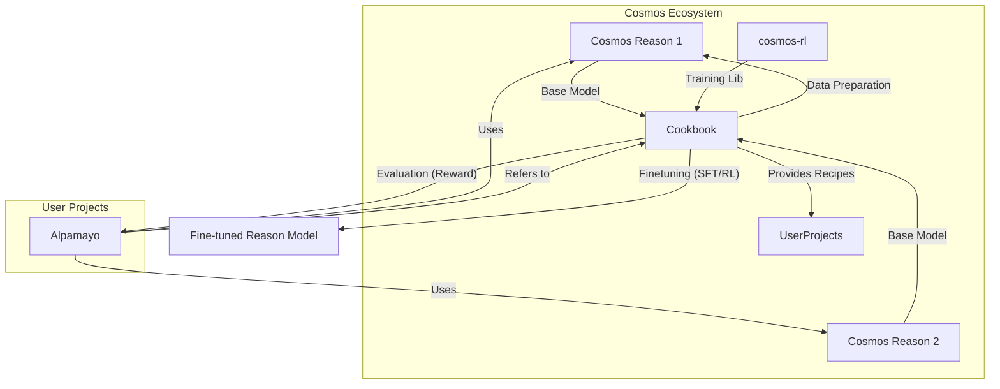

# Cosmos Cookbook Summary

**Cosmos Cookbook** は、NVIDIA Cosmos エコシステム（Cosmos Reason, Cosmos Transfer などの World Foundation Models）を活用するための**包括的なガイド（レシピ集）**です。論文そのものではなく、モデルを実際のタスク（ロボティクス、物理シーン理解、自動運転など）に適用するための「How-to」を提供するリポジトリです。

主な内容は、モデルの**推論（Inference）**、**事後学習（Post-training: SFT, RL）**、および**評価（Evaluation）**の実践的なスクリプトとドキュメントで構成されています。

## 1. エコシステム内の位置づけと関係性

各コンポーネントの関係性は以下の通りです。

*   **`cosmos-cookbook`**: 実践的なスクリプト（SFT, RL, 推論）とドキュメントの集合体。
*   **`cosmos-rl`**: Cosmos モデルの強化学習（RLHF, RLAIF）を行うためのライブラリ。Cookbook 内のレシピ（例: GRPO を用いた物理的妥当性の学習）でバックエンドとして使用されます。
*   **`cosmos-reason1` / `cosmos-reason2`**: 推論・学習の対象となる VLM (Vision-Language Model)。
    *   **Reason 1**: 物理的常識推論やビデオの品質評価（Video Critic / Reward Model）に強みを持ちます。
    *   **Reason 2**: より高度な推論能力を持ち、自動運転（AV）のビデオキャプション生成や VQA など、特定のドメイン適応のレシピが紹介されています。
*   **`alpamayo` (Alpamayo-R1)**:
    *   **関係性**: Alpamayo は、計画や軌道生成の妥当性を検証するために、Cosmos Reason モデルを「World Model」や「Verifier (検証器)」として利用していると考えられます。
    *   Cookbook にある「**Reason as Reward**（物理的妥当性スコアリング）」の手法は、Alpamayo が生成した軌道が物理的に正しいかを自動評価するための核心技術となります。

---

## 2. Cosmos Cookbook の主要コンポーネント

リポジトリは主に `docs`（ドキュメント）と `scripts`（実行スクリプト）に分かれています。

### 2.1. Post-training (事後学習)
Cosmos モデルを特定のタスクに適応させるためのパイプラインが提供されています。
*   **Supervised Fine-Tuning (SFT)**: ビデオとテキストのペアを用いた教師あり学習。
*   **Reinforcement Learning (RL)**: `cosmos-rl` を用いた強化学習。
    *   特に **GRPO (Group Relative Policy Optimization)** アルゴリズムを使用して、モデルの推論能力（Thinking Trace）とスコアリング精度を向上させるレシピが含まれています。
    *   **事例**: 「Physical Plausibility Check (物理的妥当性チェック)」では、SFT の後に RL を適用することで、物理法則（重力、衝突など）の理解度が大幅に向上することが示されています。

### 2.2. Reason as Reward (報酬モデルとしての利用)
Cosmos Reason モデルを「評価者」として利用する概念です。
*   生成されたビデオに対して、物理的な整合性や指示への忠実度をスコアリングします。
*   このスコアは、他の生成モデル（動画生成モデルや、Alpamayo のような計画モデル）の学習用報酬信号（Reward Signal）として利用可能です。
*   **Video Critic**: 単なるスコアだけでなく、詳細な批評（Critique）や推論プロセス（Chain-of-Thought）を出力させることも可能です。

### 2.3. Dataset & Metrics
*   **VideoPhy-2**: 物理的常識を評価するためのベンチマークデータセットの利用例が含まれています。
*   **Metrics**: Sampson Error（幾何的整合性）や FVD/FID（映像品質）などの評価指標計算スクリプトが含まれています。

## 3. Alpamayo への応用（示唆）

`cosmos-cookbook` の内容は、Alpamayo プロジェクトに対して以下の具体的な手段を提供します：

1.  **Verifier の構築**: Alpamayo が生成したロボットの動作や軌道が物理的に可能かどうかを、Cosmos Reason 1/2 をファインチューニングして判定させる（`physical-plausibility-check` のレシピを応用）。
2.  **強化学習による精度向上**: `cosmos-rl` の GRPO を用いて、Alpamayo の出力（または Verifier 自体）を「物理的整合性」を報酬として強化学習させる。
3.  **データ生成と評価**: シミュレーションデータや実データを用いて、自動的に評価・選別するパイプラインを構築する。
