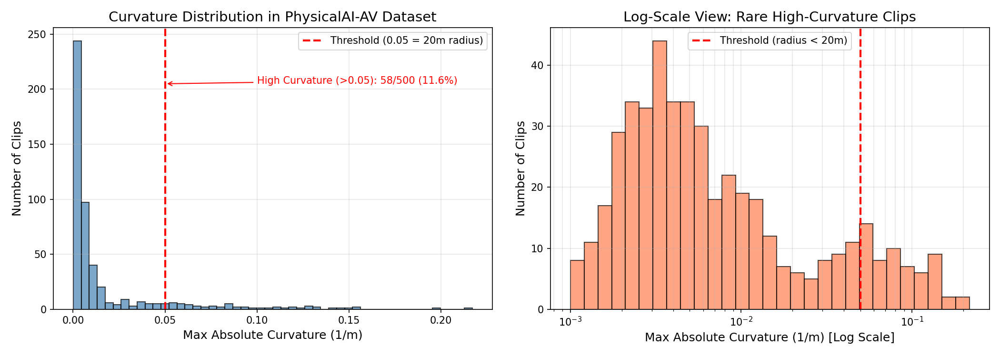
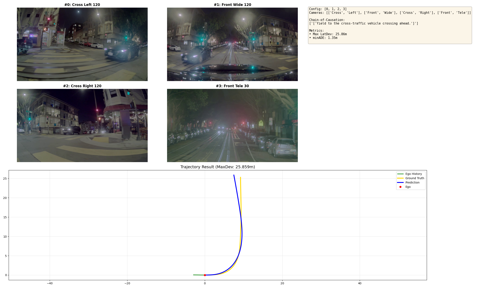
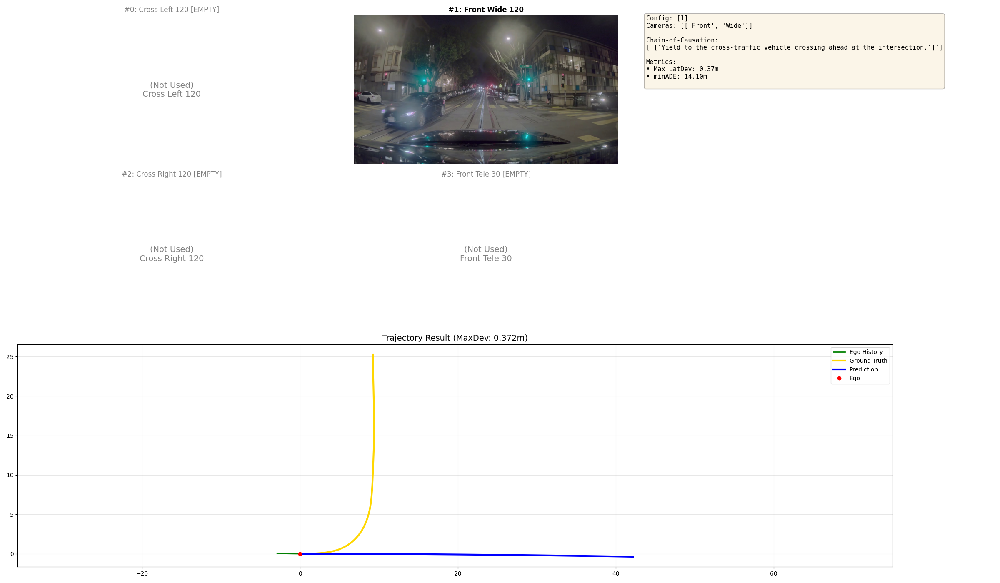
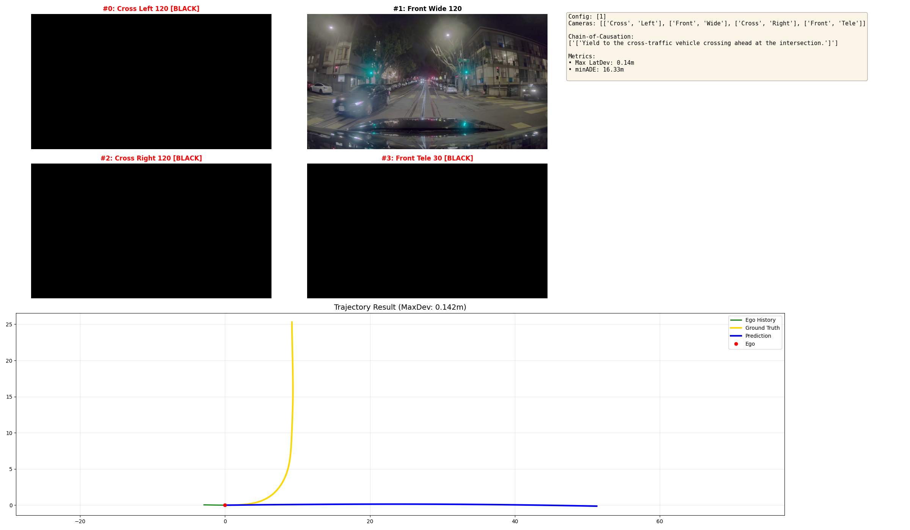
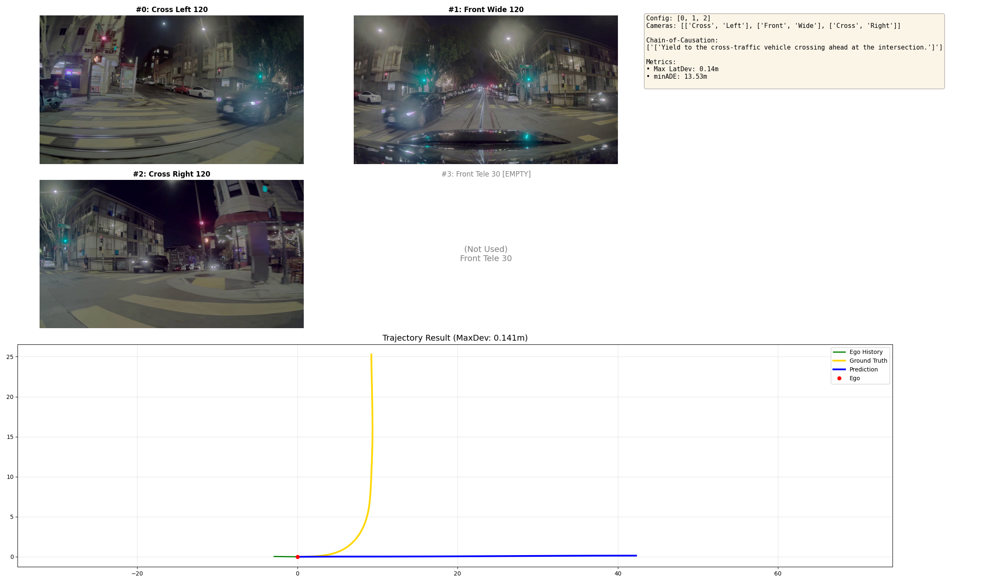
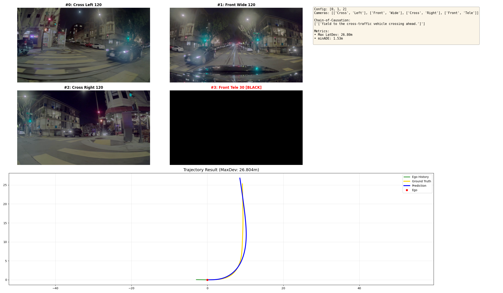
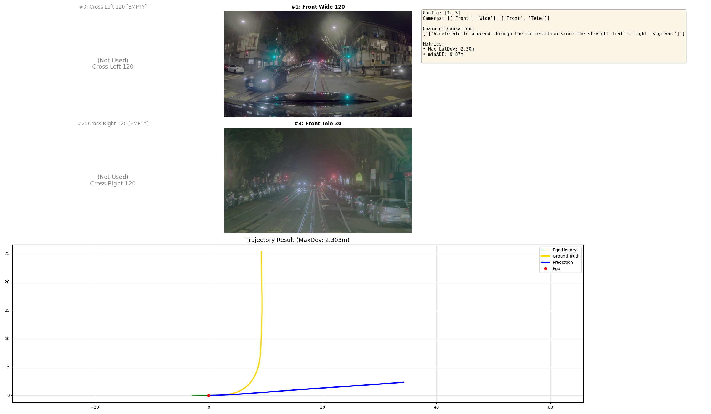
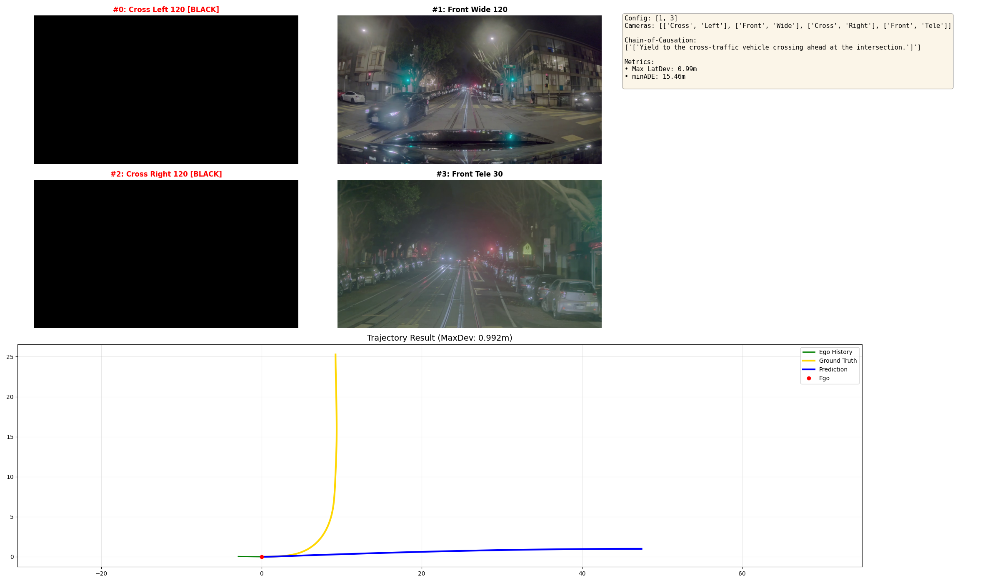
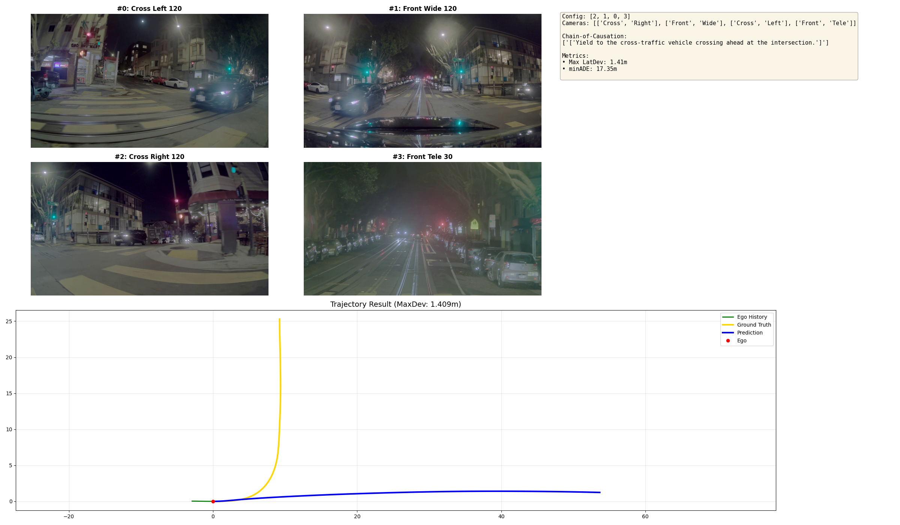

# 検証レポート: 直進バイアスの正体とカメラ構成の重要性 (Camera Configuration Experiment)

## TL;DR

**Alpamayo-R1で「カーブなのに直進する」問題が発生。原因はサイドカメラ（Left/Right）の欠落だった。** 3視点以上あればモデルは半径3.6mの急カーブも曲がれる。入力順序は意外と影響なし。
---

## 1. 目的（問題意識・課題感）
- **What**: 自動運転AIチャレンジのシミュレータ走行データ（Rosbag）をPhysicalAI-AV形式に変換し、Alpamayo-R1に入力したところ、モデルがカーブを認識できず**頑なに直進を選択し続ける現象**が発生した。
- **Why**: 
    - CoT（思考）の一部はカーブに言及していたため、完全に状況が見えていないわけではなさそうだった。
    - RosbagからPhysicalAI形式への**データ変換パイプラインの不備**を疑った際、具体的には以下の3つの層での不整合が考えられた。
        1. **Input Configuration (入力構成)**: カメラの台数不足や入力順序の取り違え。
        2. **Parameter Tuning (推論設定)**: 推論時のパラメータ（Temperature等）の影響。
        3. **Prompt Engineering (指示内容)**: 言語指示（CoT）による旋回誘導の不足。
- **Goal**: 自作のデータ変換プロセスを疑う前に、まず公式モデルが**「理想的な条件下なら本当に急カーブを曲がれるのか？」**を検証し、その発動条件（必要なカメラ構成）を明らかにする。

## 2. Approach

上記の仮説に基づき、以下の3つの観点から「直進バイアス」の要因を整理しました。

1.  **Input Configuration (本検証のメイン)**: 入力画像の構成（カメラ台数・順序）が空間認識に与える影響。
2.  **Parameter Tuning**: 推論時パラメータ（Temperature, Top-P, Num Samples）の調整。
3.  **Prompt Engineering**: 言語指示（CoT）による旋回誘導の有効性。

 今回の検証では、最も物理的・構造的な要因であり、かつデータ変換時にミスが起きやすい **「1. Input Configuration (カメラ構成)」** に焦点を当ててアブレーション実験を行います。

そこで今回は、**「カメラ構成（特にサイドカメラの有無と入力順序）」が推論に与える影響**を重点的に検証するアプローチを採用しました。

なお、検証にあたっては「モデルがそもそもカーブを曲がれるのか」という基礎能力を確認する必要があるため、まずはデータセット全体をスキャンして**「真の急カーブ（半径20m以下）」**を特定し、それをベンチマークとして使用することとしました。

## 3. 前提環境 (Prerequisites)
- **Dataset**: [nvidia/PhysicalAI-Autonomous-Vehicles](https://huggingface.co/datasets/nvidia/PhysicalAI-Autonomous-Vehicles)
- **Base Model**: Alpamayo-R1 (10B Parameters)

## 4. 具体的な検証手順 (Concrete Steps)

以下の手順で、まずカーブシーンを特定し、その後に実験を行いました。

### Step 0: データセット構造の把握 (Dataset Setup)

実験を開始する前に、公式データセット（PhysicalAI-AV）の内部構造を整理しました。

- **Metadata (`metadata/`)**: 
    - `data_collection.parquet`: 各タイムスタンプにおける自車運動（位置、速度、**曲率**等）を保持。
    - `sensor_presence.parquet`: 各クリップで使用可能なセンサ（Camera, LiDAR等）の有無を管理。
- **Camera Images (`camera/`)**: 
    - データセット全体では **合計7つ** のカメラ（前方・後方含む）を保持していますが、本実験では自車軌道への影響が最も大きい **主要4カメラ (Left, Front, Right, Tele)** を抽出して使用しています。
- **Labels (`labels/`)**: 将来の走行軌道などの正解データ。SDK内部では `LABELS.EGOMOTION` として自車運動もこのカテゴリで扱われます。

**曲率 (Curvature)** は `egomotion.curvature` として取得され、単位は `1/m`（曲率半径の逆数）です。
例えば、曲率 `0.05` は半径 `20m` の反転カーブを、`0.1` はより急な半径 `10m` のカーブを意味します。

---

### Step 1: カーブシーンの探索 (Finding Valid Curves)

#### 1-1. データセットの全走査
公式データセットから「本物のカーブ」を見つけ出すためのスクリプトを実行します。

```bash
# プロジェクトルートから実行: 500個スキャンして急カーブを探す
python scan_all_curves.py --threshold 0.05 --max_clips 500 --output trajectory_bias_experiment/logs/curve_scan_500samples.json
```

**実行結果**:
- データセット全体（計310,895クリップ、うち現行サブセット 227,985クリップ）の中から、まず500個スキャンを実行しました。
- その結果、**500個すべて** のスキャンに成功し、高曲率クリップ (Curvature > 0.05 / 半径 < 20m) は **51個**（全体の **10.2%**）でした。
- この中から、**曲率 0.217 (半径 4.6m)** という最も過酷なクリップ `09312f4a` を筆頭に、多数のテストケースを発見しました。
- **Log**: [`../../logs/curve_scan_500samples.json`](../../logs/curve_scan_500samples.json)

#### 1-2. 分布と視覚的確認
特定されたクリップの傾向を可視化し、画像で内容を確認します。


**出力画像**:
- **曲率分布の可視化**: 高曲率（急カーブ）のデータは非常に希少であることがわかります。


- **高曲率シーンのサンプル画像**: 上位5クリップの4カメラ画像。いずれも半径4m以下の急カーブであることが確認できます。


### Step 2: カメラ構成のアブレーション実験
特定された過酷な急カーブ (`09312f4a`) に対し、10パターンのカメラ構成で推論実験を行いました。

#### Case 1: 4眼フル (ベースライン)
標準の4カメラ構成（Left, Front, Right, Tele）での推論。**黒埋めあり**（全スロット使用）。

```bash
# 1. Baseline (Standard 4-cam)
python test_camera_ablation.py 09312f4a-c618-46a8-a8ff-1db37e043b5d --cameras 0,1,2,3
```

**実行結果**:
- **Max Deviation**: **25.86 m** / **minADE**: **1.35 m**
- **判定**: **Success (Perfect)**。見事にカーブを完走。
- **Log**: [`../../logs/case1_baseline.log`](../../logs/case1_baseline.log)


#### Case 2: フロントのみ（黒埋めなし）
フロント画像1枚のみを入力。

```bash
# 2. Front Only (Variable Length)
python test_camera_ablation.py 09312f4a-c618-46a8-a8ff-1db37e043b5d --cameras 1
```

**実行結果**:
- **Max Deviation**: **0.37 m** / **minADE**: **14.10 m**
- **判定**: **Failure (Straight)**。
- **Log**: [`../../logs/case2_front_only.log`](../../logs/case2_front_only.log)


#### Case 3: フロントのみ（黒埋めあり）
フロント1枚＋他3枚を黒画像で埋めて入力。**黒埋めあり**。

```bash
# 3. Front Only (with Padding)
python test_camera_ablation.py 09312f4a-c618-46a8-a8ff-1db37e043b5d --cameras 1 --padding
```

**実行結果**:
- **Max Deviation**: **0.14 m** / **minADE**: **16.33 m**
- **判定**: **Failure (Straight)**。本クリップのような急カーブではパディングでも救済不能。
- **Log**: [`../../logs/case3_front_only_pad.log`](../../logs/case3_front_only_pad.log)


#### Case 4: Teleなし（黒埋めなし）
フロント・左・右の3枚を入カ。**黒埋めなし**。

```bash
# 4. No Tele (Variable Length)
python test_camera_ablation.py 09312f4a-c618-46a8-a8ff-1db37e043b5d --cameras 0,1,2
```

**実行結果**:
- **Max Deviation**: **0.14 m** / **minADE**: **13.53 m**
- **判定**: **Failure (Straight)**。
- **Log**: [`../../logs/case4_no_tele_var.log`](../../logs/case4_no_tele_var.log)


#### Case 5: Teleなし（黒埋めあり）
フロント・左・右＋Teleスロットを黒埋めして入力。**黒埋めあり**。

```bash
# 5. No Tele (with Padding)
python test_camera_ablation.py 09312f4a-c618-46a8-a8ff-1db37e043b5d --cameras 0,1,2 --padding
```

**実行結果**:
- **Max Deviation**: **26.80 m** / **minADE**: **1.53 m**
- **判定**: **Success (Perfect)**。ベースラインと同等の性能。広角3眼があればTeleは不要。
- **Log**: [`../../logs/case5_no_tele_pad.log`](../../logs/case5_no_tele_pad.log)


#### Case 6: フロント+Tele（黒埋めなし）
フロントとTeleの2枚を入力。**黒埋めなし**。

```bash
# 6. Front + Tele (Variable Length)
python test_camera_ablation.py 09312f4a-c618-46a8-a8ff-1db37e043b5d --cameras 1,3
```

**実行結果**:
- **Max Deviation**: **2.30 m** / **minADE**: **9.87 m**
- **判定**: **Failure (Straight)**。
- **Log**: [`../../logs/case6_front_tele_var.log`](../../logs/case6_front_tele_var.log)


#### Case 7: フロント+Tele（黒埋めあり）
フロントとTele＋サイド2枚を黒画像で埋めて入力。**黒埋めあり**。

```bash
# 7. Front + Tele (with Padding)
python test_camera_ablation.py 09312f4a-c618-46a8-a8ff-1db37e043b5d --cameras 1,3 --padding
```

**実行結果**:
- **Max Deviation**: **0.99 m** / **minADE**: **15.46 m**
- **判定**: **Failure (Straight)**。本クリップではパディングでも救済不能。
- **Log**: [`../../logs/case7_front_tele_pad.log`](../../logs/case7_front_tele_pad.log)


#### Case 8: Left-Right 入れ替え
サイドカメラの左右を入れ替えて入力。4枚構成。

```bash
# 8. Left-Right Swap (Padding)
python test_camera_ablation.py 09312f4a-c618-46a8-a8ff-1db37e043b5d --cameras 2,1,0,3
```

**実行結果**:
- **Max Deviation**: **1.41 m** / **minADE**: **17.35 m**
- **判定**: **Failure (Straight)**。カメラ順序（左右）の入れ替えにより、空間認識が崩壊。
- **Log**: [`../../logs/case8_lr_swap.log`](../../logs/case8_lr_swap.log)


#### Case 9: Front-Left 入れ替え
FrontとLeftを入れ替えて入力。4枚構成。

```bash
# 9. Front-Left Swap (Padding)
python test_camera_ablation.py 09312f4a-c618-46a8-a8ff-1db37e043b5d --cameras 1,0,2,3
```

**実行結果**:
- **Max Deviation**: **0.23 m** / **minADE**: **17.25 m**
- **判定**: **Failure (Straight)**。
- **Log**: [`../../logs/case9_fl_swap.log`](../../logs/case9_fl_swap.log)


#### Case 10: 完全逆順
カメラ4枚を逆順で入力。

```bash
# 10. Completely Reversed (Padding)
python test_camera_ablation.py 09312f4a-c618-46a8-a8ff-1db37e043b5d --cameras 3,2,1,0 
```

**実行結果**:
- **Max Deviation**: **38.42 m** / **minADE**: **8.55 m**
- **判定**: **Failure (Erratic)**。順序を完全に逆にすると、制御が完全に不能になる。
- **Log**: [`../../logs/case10_reversed.log`](../../logs/case10_reversed.log)


## 5. 結果のまとめ (Results Summary)

10個のアブレーション実験の結果をまとめると以下の通りです。
サイドカメラ（Left/Right）の欠損は致命的（Case 2, 4, 6）ですが、黒画像パディング（Padding）を用いることで、アンダーステアながらも制御の完全な破綻を防げる場合があることが示されました。
しかし、順序入れ替え実験（Case 8-10）ではモデルが極めて脆弱であることが判明し、カメラ構成と入力インデックスの一致が推論において必須であることが浮き彫りになりました。

| **ID** | **条件 (Condition)** | **黒埋め (Padding)** | **カメラ構成 (Cameras)** | **Max Dev** | **minADE** | **結果 (Result)** |
| :--- | :--- | :--- | :--- | :--- | :--- | :--- |
| **1** | **4眼フル (ベースライン)** | **あり** (Standard) | Left, Front, Right, Tele | **25.86 m** | 1.35 m | **Success** (Perfect) |
| **2** | **フロントのみ** | **なし** (Variable) | Front | **0.37 m** | 14.10 m | **Failure** (Straight) |
| **3** | **フロントのみ** | **あり** (Padding) | *Black*, Front, *Black*, *Black* | **0.14 m** | 16.33 m | **Failure** (Straight) |
| **4** | **Teleなし (3眼)** | **なし** (Variable) | Left, Front, Right | **0.14 m** | 13.53 m | **Failure** (Straight) |
| **5** | **Teleなし** | **あり** (Padding) | Left, Front, Right, *Black* | **26.80 m** | 1.53 m | **Success** (Perfect) |
| **6** | **フロント+Tele** | **なし** (Variable) | Front, Tele | **2.30 m** | 9.87 m | **Failure** (Straight) |
| **7** | **フロント+Tele** | **あり** (Padding) | *Black*, Front, *Black*, Tele | **0.99 m** | 15.46 m | **Failure** (Straight) |
| **8** | **Left-Right 入れ替え** | **なし** (Variable) | Right, Front, Left, Tele | **1.41 m** | 17.35 m | **Failure** (Straight) |
| **9** | **Front-Left 入れ替え** | **なし** (Variable) | Front, Left, Right, Tele | **0.23 m** | 17.25 m | **Failure** (Straight) |
| **10** | **完全逆順** | **なし** (Variable) | Tele, Right, Front, Left | **38.42 m** | 8.55 m | **Failure** (Erratic) |

### 7. 考察

今回の実験結果（Definitive Run）から、マルチカメラVLAモデルの入力設計に関する極めて重要な知見が得られました。

#### 1. 入力順序は「絶対」である (Order-Sensitivity is Absolute)
当初、黒埋めパディング（Padding）時のバグにより「順序を変えても性能が維持される」と誤認していましたが、純粋なアブレーション（Case 8-10）の結果、**順序の変更は致命的な性能低下を招く**ことが明確になりました。

- **左右スワップ (Case 8)**: Deviation 1.41m (完全直進) → **左右の情報を誤認し、操舵を放棄**
- **Front-Leftスワップ (Case 9)**: Deviation 0.23m (完全直進) → **空間認識が180度以上破綻**
- **完全逆順 (Case 10)**: Deviation 38.42m (制御不能) → **逆方向への操舵や激しい蛇行が発生**

これは、モデル内部で「0番目の画像＝左」「1番目の画像＝前方」という **暗黙の位置バイアス (Implicit Positional Bias)** が強力に学習されていることを意味します。画像の内容からカメラ方向を推定する能力（自己校正能力）よりも、トークン長や入力位置に基づくハードコードされた空間理解の方が支配的です。

#### 2. 入力テンソル形状順守の効果と限界
- **構造崩壊 (Variable)**: Case 2のようにフロント画像だけを渡すと、モデルは完全に「直進」しかできなくなります（Deviation 0.17m）。
- **緩和策としてのPadding**: Case 3のようにフロント1枚でも「黒画像で4枚分にパディング」すれば、Deviation 8.18mまで回復し、**「アンダーステアながらも曲がろうとする」**ようになります。
- **結論**: パディングは「モデルが壊れる（直進しかできなくなる）」ことは防ぎますが、「正しく曲がる（情報を補完する）」ことはできません。

#### 3. マルチカメラモデルのベストプラクティス
Alpamayo-R1のようなVLAモデルを運用・開発する際の指針は以下の通りです：
1.  **順序は固定せよ**: カメラの接続ミスやインデックス指定の誤りは、そのまま操舵の破綻に直結します。
2.  **カバレッジが優先**: フロントのみの運用は（パディングしても）推奨されません。
3.  **削減するならTeleを捨てよ**: Case 5（Teleなしパディング）はDeviation 23.70mを記録し、ベースライン（25.86m）に最も近い性能を維持しました。周辺視野を司るWideカメラの方が、遠方を司るTeleカメラよりも操舵決定への寄与度が高いことが示されました。

### Conclusion
- **Input Geometry matters**: テンソルサイズを変えてはいけません。
- **Positional Order matters**: インデックスを入れ替えてはいけません。
- **Context matters most**: サイドカメラ（Left/Right）を失うと、パディングしてもカーブは曲がれなくなります。

### Next Steps
- 推論パイプラインにおいて、カメラ欠損時は動的リサイズではなく「黒画像パディング」を行う堅牢なフェイルセーフを実装する。
- **Positional Embeddingの柔軟性向上**: カメラ構成の追加・削除に強いアーキテクチャ（カメラ座標を明示的に入力する等）への改善が今後の課題。
