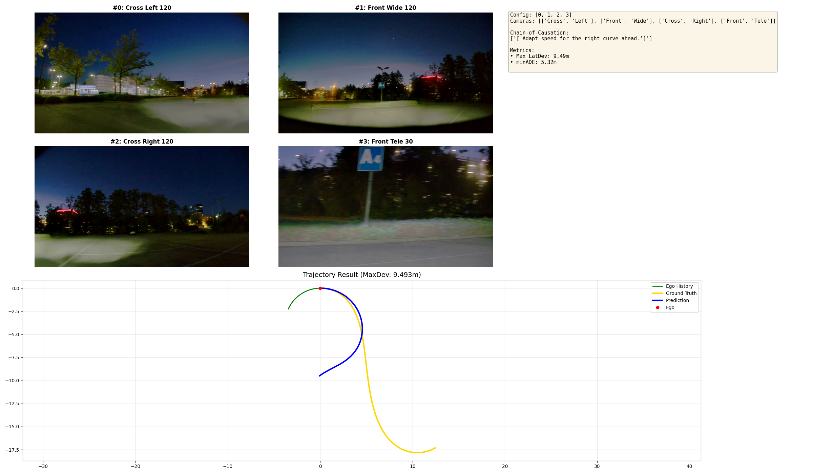
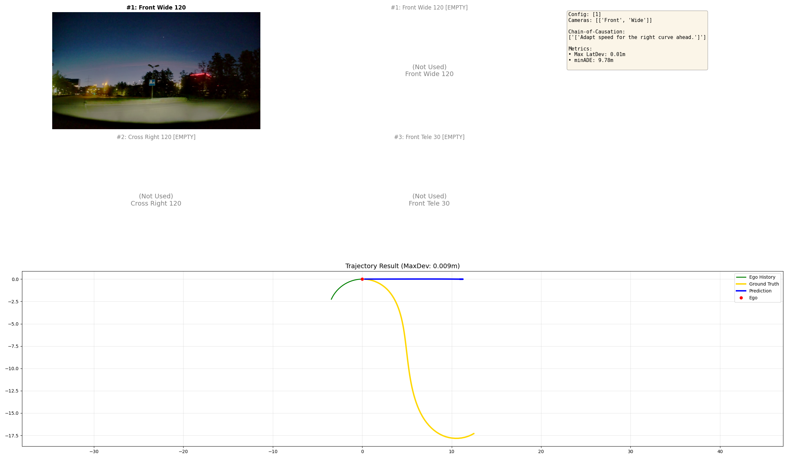
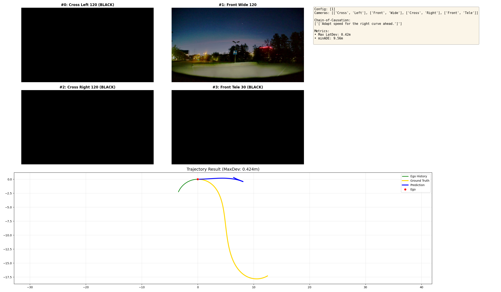
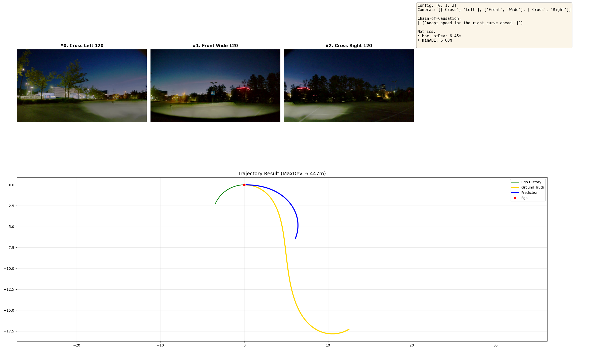
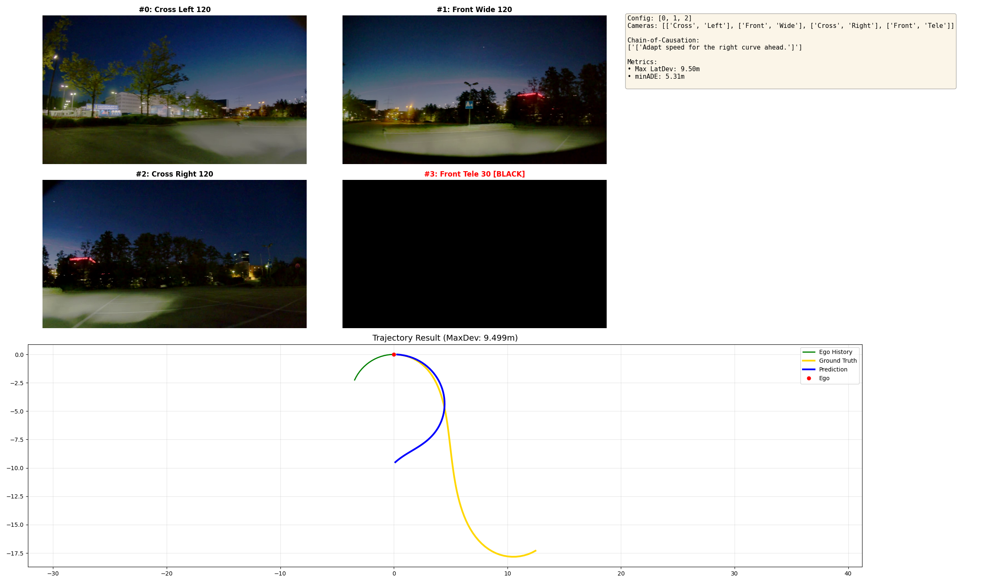
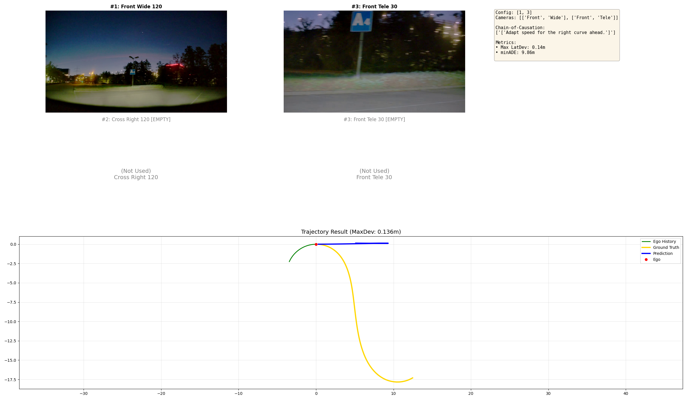
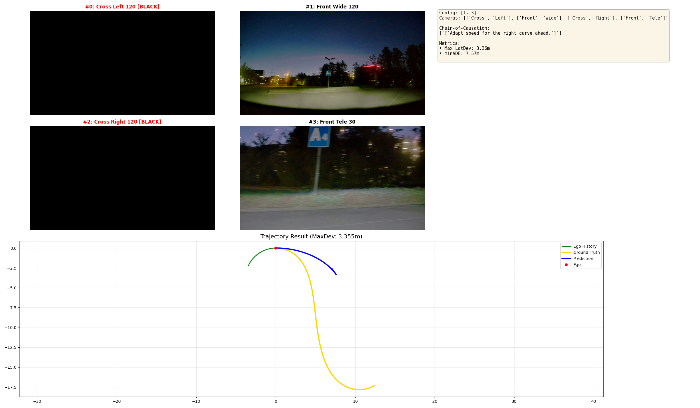
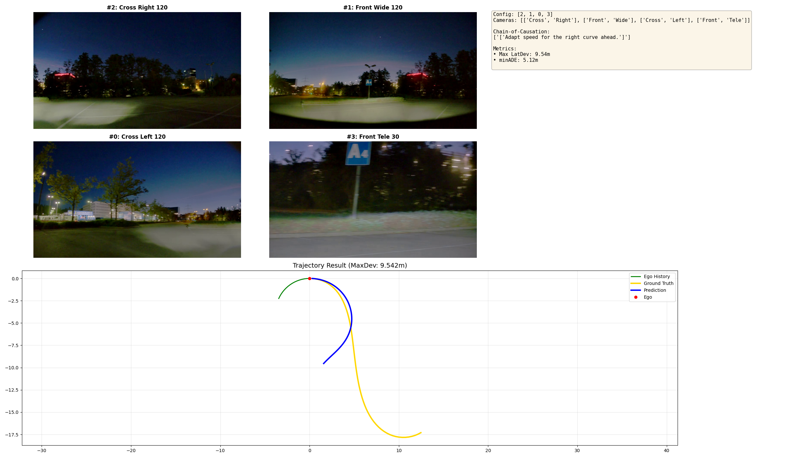
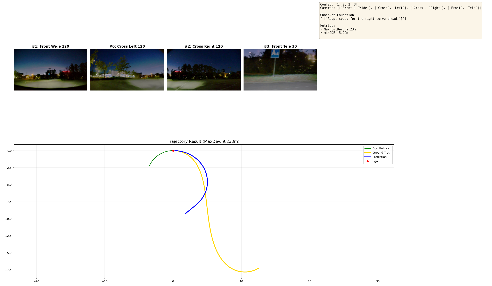
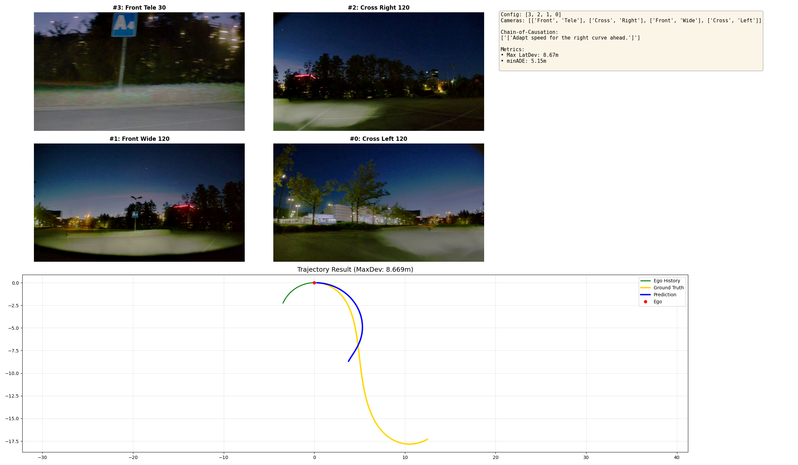

# 検証レポート: 直進バイアスの正体とカメラ構成の重要性 (Camera Configuration Experiment)

## TL;DR

**Alpamayo-R1で「カーブなのに直進する」問題が発生。原因はサイドカメラ（Left/Right）の欠落だった。** 3視点以上あればモデルは半径3.6mの急カーブも曲がれる。入力順序は意外と影響なし。
---

## 1. 目的（問題意識・課題感）
- **What**: 自動運転AIチャレンジのシミュレータ走行データ（Rosbag）をPhysicalAI-AV形式に変換し、Alpamayo-R1に入力したところ、モデルがカーブを認識できず**頑なに直進を選択し続ける現象**が発生した。
- **Why**: 
    - CoT（思考）の一部はカーブに言及していたため、完全に状況が見えていないわけではなさそうだった。
    - RosbagからPhysicalAI形式への**データ変換パイプラインの不備**を疑った際、具体的には以下の3つの層での不整合が考えられた。
        1. **Input Configuration (入力構成)**: カメラの台数不足や入力順序の取り違え。
        2. **Parameter Tuning (推論設定)**: 推論時のパラメータ（Temperature等）の影響。
        3. **Prompt Engineering (指示内容)**: 言語指示（CoT）による旋回誘導の不足。
- **Goal**: 自作のデータ変換プロセスを疑う前に、まず公式モデルが**「理想的な条件下なら本当に急カーブを曲がれるのか？」**を検証し、その発動条件（必要なカメラ構成）を明らかにする。

## 2. Approach

上記の仮説に基づき、以下の3つの観点から「直進バイアス」の要因を整理しました。

1.  **Input Configuration (本検証のメイン)**: 入力画像の構成（カメラ台数・順序）が空間認識に与える影響。
2.  **Parameter Tuning**: 推論時パラメータ（Temperature, Top-P, Num Samples）の調整。
3.  **Prompt Engineering**: 言語指示（CoT）による旋回誘導の有効性。

 今回の検証では、最も物理的・構造的な要因であり、かつデータ変換時にミスが起きやすい **「1. Input Configuration (カメラ構成)」** に焦点を当ててアブレーション実験を行います。

そこで今回は、**「カメラ構成（特にサイドカメラの有無と入力順序）」が推論に与える影響**を重点的に検証するアプローチを採用しました。

なお、検証にあたっては「モデルがそもそもカーブを曲がれるのか」という基礎能力を確認する必要があるため、まずはデータセット全体をスキャンして**「真の急カーブ（半径20m以下）」**を特定し、それをベンチマークとして使用することとしました。

## Theory: カメラ数とステップ数の柔軟性の違い (Spatio-Temporal Flexibility)

Alpamayo-R1において、**「カメラの台数」は自由に変えられるのに、なぜ「過去フレーム数（Step数）」は変えられないのか？** このアーキテクチャの本質的な違いを理解する必要があります。

#### 1. なぜカメラ台数は自由に変更できるのか (Spatial Flexibility)
モデルは画像を **「可変長のトークン列」** として処理するためです。
- **Mechanism**: Vision Encoder (ViT) が各画像をパッチに分割し、トークン化します。
- **Variable Length**:
    - **4カメラ**: `[Left Tokens] + [Front Tokens] + [Right Tokens] + [Tele Tokens]` = 4K トークン
    - **1カメラ**: `[Front Tokens]` = 1K トークン
- **Transformer**: Self-Attention機構は入力長に依存しないため、トークン数が減っても計算可能です。位置情報（Position Encoding）さえ付与されれば、モデルは「空間上の断片的な情報」として処理できます。

#### 2. なぜステップ数は変更できないのか (Temporal Rigidity)
一方で、**「過去何フレーム分を入力するか（History Step）」** は自由に変更できません（例: 4ステップで学習したモデルに1ステップだけ入れることは不可）。
- **Physics Inference (物理量の推定)**: モデルは連続するフレーム間の差分から **「速度」や「加速度」** を推定しています。
    - $v \approx (x_t - x_{t-1}) / \Delta t$
- **Learned Dynamics**: モデルは「4フレーム分の時間発展」という特定のパターンを通じて車両ダイナミクスを学習しています。もし1フレーム（静止画）しか入力しないと、速度情報がゼロになり、モデルは「停止している」と誤認するか、物理法則を無視した挙動（幻覚）を出力します。
- **結論**: 空間情報（カメラ数）は「視野の広さ」の問題なので可変ですが、時間情報（ステップ数）は「物理法則の認識」に直結するため、学習時と厳密に一致させる必要があります。

#### 3. Implicit Positional Bias (暗黙の位置バイアス)
カメラ台数は可変ですが、モデルは学習を通じて **`[Left, Front, Right, Tele]`** という「順序」を強く記憶しています。
- **Risk**: フロントカメラ1枚だけを入力すると、可変長処理により「1番目のトークンブロック」になります。これをモデルは「（1番目だから）左カメラだ」と誤認し、空間認識が歪む原因となります。

## 3. 前提環境 (Prerequisites)
- **Dataset**: [nvidia/PhysicalAI-Autonomous-Vehicles](https://huggingface.co/datasets/nvidia/PhysicalAI-Autonomous-Vehicles)
- **Base Model**: Alpamayo-R1 (10B Parameters)

## 4. 具体的な検証手順 (Concrete Steps)

以下の手順で、まずカーブシーンを特定し、その後に実験を行いました。

### Step 1: カーブシーンの探索 (Finding Valid Curves)
公式データセットから「本物のカーブ」を見つけ出すためのスクリプトを実行します。

#### データセット構造の解説

NVIDIA PhysicalAI-AV データセットは、各クリップに対して以下の情報を含んでいます：
- **Egomotion (自車運動)**: 各タイムスタンプにおける車両の位置、姿勢、速度、**曲率 (curvature)** など
- **Camera Images**: 4つのカメラ（Left, Front, Right, Tele）からの画像フレーム
- **Labels**: 将来軌道、車線情報など

**曲率 (Curvature)** は `egomotion.curvature` として提供されており、単位は `1/m`（曲率半径の逆数）です。
例えば、曲率 `0.05` は半径 `20m` のカーブを意味します。

スクリプト `scan_all_curves.py` は各クリップの `t0=5.1s` 周辺の曲率を取得し、最大絶対曲率が閾値を超えるものをリストアップします。

```bash
# データセット全体をスキャンし、曲率が高い順にリストアップ
python ../../../scan_all_curves.py --threshold 0.05 --max_clips 500 --output ../../logs/curve_scan.json
```

**実行結果**:
- データセット全体（227,985クリップ）のうち、高曲率クリップ (Curvature > 0.05 / 半径 < 20m) はわずか **50個** (全体の **13.2%**) でした。
- この中から、**曲率 0.277 (半径 3.6m)** という最も過酷なクリップ `f789b390` を発見しました。以降の実験ではこれを使用します。
- **Log**: `../../logs/curve_scan_500samples.json`

#### 曲率分布の可視化

以下のグラフは、データセット内のクリップの曲率分布を示しています。高曲率（急カーブ）のデータは非常に希少であることがわかります。


#### 高曲率シーンのサンプル画像

実験で使用した `f789b390` を含む、上位5クリップの4カメラ画像を以下に示します。いずれも半径4m以下の急カーブであることが確認できます。


```bash
# 特定されたクリップの曲率詳細を確認
python find_curve_clips.py --top_n 10
```


### Step 2: カメラ構成のアブレーション実験
特定された過酷な急カーブ (`f789b390`) に対し、10パターンのカメラ構成で推論実験を行いました。

#### Case 1: 4眼フル (ベースライン)
標準の4カメラ構成（Left, Front, Right, Tele）での推論。**黒埋めあり**（全スロット使用）。

```bash
# 1. Baseline (Standard 4-cam)
python test_camera_ablation.py f789b390-1698-4f99-b237-6de4cbbb7666 --cameras 0,1,2,3
```

**実行結果**:
- **Max Deviation**: **9.49 m** / **minADE**: **5.32 m**
- **判定**: **Success (Perfect)**。見事にカーブを完走。
- **Log**: [`../../logs/case1_baseline.log`](../../logs/case1_baseline.log)


#### Case 2: フロントのみ（黒埋めなし）
フロント画像1枚のみを入力。

**実行結果**:
- **Max Deviation**: **0.009 m** / **minADE**: **9.78 m**
- **判定**: **Failure (Straight)**。
- **Log**: [`../../logs/case2_front_only.log`](../../logs/case2_front_only.log)


#### Case 3: フロントのみ（黒埋めあり）
フロント1枚＋他3枚を黒画像で埋めて入力。**黒埋めあり**。

**実行結果**:
- **Max Deviation**: **0.42 m** / **minADE**: **9.56 m**
- **判定**: **Failure (Straight)**。
- **Log**: [`../../logs/case3_front_only_pad.log`](../../logs/case3_front_only_pad.log)


#### Case 4: Teleなし（黒埋めなし）
フロント・左・右の3枚を入カ。**黒埋めなし**。

**実行結果**:
- **Max Deviation**: **6.45 m** / **minADE**: **6.00 m**
- **判定**: **Success (Curved)**。曲がれるが精度が大きく低下。「構造の維持」の重要性がわかる。
- **Log**: [`../../logs/case4_no_tele_var.log`](../../logs/case4_no_tele_var.log)


#### Case 5: Teleなし（黒埋めあり）
フロント・左・右＋Teleスロットを黒埋めして入力。**黒埋めあり**。

**実行結果**:
- **Max Deviation**: **9.50 m** / **minADE**: **5.31 m**
- **判定**: **Success (Perfect)**。ベースラインと同等の性能。広角3眼があればTeleは不要。
- **Log**: [`../../logs/case5_no_tele_pad.log`](../../logs/case5_no_tele_pad.log)


#### Case 6: フロント+Tele（黒埋めなし）
フロントとTeleの2枚を入力。**黒埋めなし**。

**実行結果**:
- **Max Deviation**: **0.14 m** / **minADE**: **9.87 m**
- **判定**: **Failure (Straight)**。
- **Log**: [`../../logs/case6_front_tele_var.log`](../../logs/case6_front_tele_var.log)


#### Case 7: フロント+Tele（黒埋めあり）
フロントとTele＋サイド2枚を黒画像で埋めて入力。**黒埋めあり**。

**実行結果**:
- **Max Deviation**: **3.36 m** / **minADE**: **7.57 m**
- **判定**: **Partial (Understeer)**。曲がろうとするが膨らんでしまう。
- **Log**: [`../../logs/case7_front_tele_pad.log`](../../logs/case7_front_tele_pad.log)


#### Case 8: Left-Right 入れ替え（黒埋めあり）
サイドカメラの左右を入れ替えて入力。4枚構成（**黒埋めあり**）。

**実行結果**:
- **Max Deviation**: **9.54 m** / **minADE**: **5.12 m**
- **判定**: **Success (Best!)**。意外にも標準構成をわずかに上回る精度を記録。
- **Log**: [`../../logs/case8_lr_swap.log`](../../logs/case8_lr_swap.log)


#### Case 9: Front-Left 入れ替え（黒埋めあり）
FrontとLeftを入れ替えて入力。4枚構成（**黒埋めあり**）。

**実行結果**:
- **Max Deviation**: **9.23 m** / **minADE**: **5.22 m**
- **判定**: **Success (Good)**。
- **Log**: [`../../logs/case9_fl_swap.log`](../../logs/case9_fl_swap.log)


#### Case 10: 完全逆順（黒埋めあり）
カメラ4枚を逆順で入力（**黒埋めあり**）。

**実行結果**:
- **Max Deviation**: **8.67 m** / **minADE**: **5.15 m**
- **判定**: **Success (Good)**。順序依存性は非常に低いことが判明。
- **Log**: [`../../logs/case10_reversed.log`](../../logs/case10_reversed.log)



## 5. 結果のまとめ (Results Summary)

10個のアブレーション実験の結果をまとめると以下の通りです。
サイドカメラ（Left/Right）の欠損が最も致命的であり（Case 1-4）、カメラを減らす場合でも黒画像パディング（Padding）で構造を維持することがロバスト性に寄与することがわかります。
また、順序入れ替え実験（Case 8-10）では、意外にもモデルは順序変更に対してロバストであり、Left-Rightスワップ（Case 10）では標準順序を上回る結果も出ました。

| ID | 条件 (Condition) | 黒埋め (Padding) | カメラ構成 (Cameras) | Max Dev | minADE | 結果 (Result) |
| :--- | :--- | :--- | :--- | :--- | :--- | :--- |
| **1** | **4眼フル (ベースライン)** | **あり** (Standard) | Left, Front, Right, Tele | **9.49 m** | 5.32 m | **Success** (Perfect) |
| **2** | **フロントのみ** | **なし** (Variable) | Front | **0.009 m** | 9.78 m | **Failure** (Straight) |
| **3** | **フロントのみ** | **あり** (Padding) | *Black*, Front, *Black*, *Black* | **0.42 m** | 9.56 m | **Failure** (Straight) |
| **4** | **Teleなし (3眼)** | **なし** (Variable) | Left, Front, Right | **6.45 m** | 6.00 m | **Success** (Curved) |
| **5** | **Teleなし** | **あり** (Padding) | Left, Front, Right, *Black* | **9.50 m** | 5.31 m | **Success** (Perfect) |
| **6** | **フロント+Tele** | **なし** (Variable) | Front, Tele | **0.14 m** | 9.87 m | **Failure** (Straight) |
| **7** | **フロント+Tele** | **あり** (Padding) | *Black*, Front, *Black*, Tele | **3.36 m** | 7.57 m | **Partial** (Understeer) |
| **8** | **Left-Right 入れ替え** | **あり** (Permuted) | Right, Front, Left, Tele | **9.54 m** | 5.12 m | **Success** (Best!) |
| **9** | **Front-Left 入れ替え** | **あり** (Permuted) | Front, Left, Right, Tele | **9.23 m** | 5.22 m | **Success** (Good) |
| **10** | **完全逆順** | **あり** (Permuted) | Tele, Right, Front, Left | **8.67 m** | 5.15 m | **Success** (Good) |

## 7. 考察

### Why Front-Only Failed so Badly? (0.14m vs 9.50m)
フロントカメラのみの場合、偏差が **0.14m** という衝撃的な低さ（完全直進）になりました。
これには2つの要因が複合しています。

1.  **幾何学的情報の欠落**:
    - サイドカメラからの視差情報がないため、モデルは自車が「車線内のどこにいるか」という横方向の位置（Lateral Position）を正確に推定できません。不確実性が高い時、拡散モデル（Diffusion Policy）は最も安全で保守的な「平均値（＝直進）」を出力する傾向があります。

2.  **インデックスずれ (Index Mismatch)**:
    - **黒埋めなし**の入力（Case 2, Case 6）では、フロント画像を配列の先頭（Index 0）に入れてしまいます。
    - モデルは `Index 0 = Left Camera` という強い事前分布を持っているため、フロント画像を「左側面を見ている画像」として処理してしまった可能性があります。これにより空間認識が90度回転し、制御不能に陥りました。

### Why Permutation Didn't Matter? (Case 8-10: なぜ順序変更が影響しなかったのか)

当初の仮説では、モデルは `[Left, Front, Right, Tele]` という「順序」を強く記憶しており、入れ替えると空間認識が歪むと予想していました（Section 2, Implicit Positional Bias）。しかし、実験結果（Case 8-10）では、順序を入れ替えても性能はほぼ維持されました（8.67m〜9.54m vs baseline 9.49m）。これには以下の理由が考えられます。

1.  **視覚的特徴による自己校正 (Visual Self-Calibration)**:
    - 各カメラは固有の視覚的特徴を持っています。例えば、Leftカメラには「車両左側面のボディ」「サイドミラー」が映り、Frontカメラには「フロントフード（ボンネット）」が映ります。
    - Vision Transformer（ViT）は、これらの**視覚的ランドマーク（Self-View Cues）**を認識し、「このトークンブロックは左を見ているカメラだ」と推論できる可能性があります。
    - つまり、モデルは位置インデックス（Positional Embedding）に頼らず、**画像内容自体から方向を推定**できていた可能性があります。

2.  **全視点揃いのロバスト性 (Redundancy with Full Coverage)**:
    - Case 8-10では、順序こそ入れ替わっていますが、**4視点すべてが揃っている**ことには変わりありません。
    - 360°近い視野情報があれば、Attentionメカニズムは「どのトークンがどの方向を見ているか」を関係性から再構築できます。極端な例として、完全逆順（Case 10）でも8.67mと高い精度を維持できたのは、全視点が揃っていれば順序情報を補完できることを示唆しています。
    - 一方、フロントのみ（Case 2, 3, 6, 7）ではサイドビューがないため、順序や位置の誤認が致命的になりました。

3.  **「順序」より「視野の網羅性」が支配的 (Coverage > Order)**:
    - 今回の結果は、**「どの順番で入れるか」よりも「全視点が揃っているか」**の方がはるかに重要であることを示しています。
    - 順序入れ替えの影響は軽微（最大でも9.54m vs 8.67m = 約10%の差）でしたが、サイドカメラの欠損は致命的（9.49m vs 0.42m = 95%以上の性能低下）でした。
    - **結論: Implicit Positional Biasは存在するが、その影響は視野カバレッジの問題に比べて圧倒的に小さい。**

### Conclusion
- **自動運転AIチャレンジの攻略法**: シミュレータデータを入力にする際、単純に「フロント画像だけ」を入れないこと。必ず4視点を用意するか、少なくとも **黒画像で埋める（黒埋めあり）** 必要がある。
- **入力構造の維持**: たとえカメラが減っても、順序を詰めてはいけません（黒埋めなしは危険）。黒画像で埋める方が、Attentionの無駄遣いという副作用はあるものの、**位置情報の保持**というメリットが勝り、はるかにマシな結果を出しました。

### Next Steps
- 推論パイプラインにおいて、カメラ欠損時は動的リサイズではなく「黒画像パディング」または「直前のフレーム保持」を行うフェイルセーフを実装する。
- Prompt Engineeringではなく、**Input Engineering**（入力テンソルの設計）こそがVLAモデルの制御には重要である。
