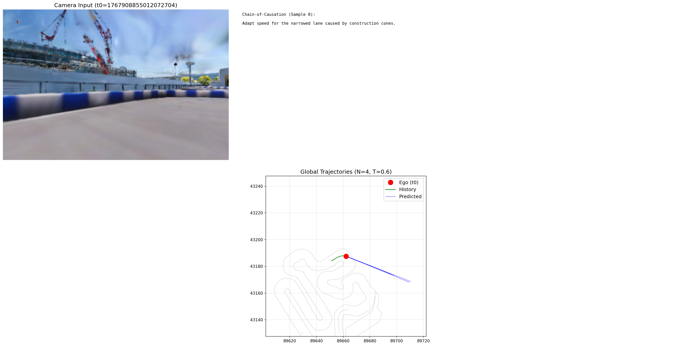

# 検証レポート: 推論パラメータ調整と直進バイアスの限界 (Parameter Tuning Experiment)

## 0. TL;DR
- **What**: **Alpamayo-R1**において発生する「直進バイアス」の問題に対し、モデルの再学習（Fine-tuning）を行わず、ユーザーが**推論時（Inference-time）に手軽に変更可能なパラメータ**のみを調整することで解決できるかを検証した。
- **Result**: Temperature, Prompt, Num Samples, Top-Pのいずれを調整してもバイアスは解消されなかった。外部調査により、これは設定ミスではなく、モデルの学習済み分布（Mode Collapse）やアライメント不足に起因する構造的な課題であることが裏付けられた。
- **So What**: 推論パラメータの調整では解決不可能であり、**Cosmos Cookbookを用いたFine-tuning（SFT + RL）** が不可欠である。

---

## 1. 目的（実験の背景）
- **Context**: Alpamayo-R1において、特定のカーブ走行シーンでモデルが頑なに「直進」を選択し続ける問題（**直進バイアス**）が確認されました。
- **Goal**: バイアスが「パラメータ設定の不備」によるものなのか、それとも「モデルの学習特性」として固定化されているものなのかを明らかにします。

---

## 2. Approach

本検証では、以下の4つのパラメータに焦点を当てて調整を行いました。

1.  **Temperature**: 生成の多様性制御
2.  **Prompt**: 入力指示による思考誘導
3.  **Num Samples**: 生成候補数の増加による良質軌道の探索
4.  **Top-P**: 確率分布のサンプリング範囲調整

### 調査対象外のパラメータ (Out of Scope)
**Input History Length (入力履歴長)**:
デフォルトの **16 step** からの変更は本調査の対象外とします。
*   **理由**: モデルが固定長の履歴トークン（48 token = 16 steps）を前提に学習されており、推論コードやデータパイプラインもこの設定に強く依存（ハードコード）しているため。再学習なしでの変更はモデルの想定入力分布（Distribution）を大きく崩すリスクがあります。

#### 対比: なぜ履歴長は変えられないのか
カメラ台数とは対照的に、**履歴長（16ステップ）は固定**です。

```python
num_traj_token = 48  # ← ハードコードされた固定値
```

モデルは「16ステップの3D座標データ」を「固定48トークン」に圧縮する専用の**Projector（射影層）**を持っており、この層は固定サイズ入力を前提に学習されているため、変更するとエラーが発生します。

---

## 3. 具体的な検証手順 (Concrete Steps)

以下の4つの実験を行い、それぞれの効果を検証しました。

### Experiment 1: Temperature Tuning (温度パラメータ)

#### 目的 (Objective)
軌道生成時のサンプリング温度 (Temperature) を変化させることで、生成される軌道の多様性を高め、隠れた「カーブ予測」が出現するか検証する。

#### 実験設定 (Configuration)
*   **対象**: サンプリング温度 (Temperature)
*   **比較値**: 0.1 (Greedy), 0.6 (Default), 0.8, 1.0
*   **サンプル数**: 4

#### 実行コマンド (Execution Command)
```bash
# Low Temp
python ../../../debug_viz.py --num_samples 4 --temperature 0.1 --top_p 0.90 --output ../../images/debug_t0.1.png
# Default
python ../../../debug_viz.py --num_samples 4 --temperature 0.6 --output ../../images/debug_t0.6.png
# High Temp
python ../../../debug_viz.py --num_samples 4 --temperature 0.8 --output ../../images/debug_t0.8.png
# Extreme
python ../../../debug_viz.py --num_samples 4 --temperature 1.0 --output ../../images/debug_t1.0.png
```

#### 結果 (Results)
- **Logs**:
  - `../../logs/viz_lowtemp.log`
  - `../../logs/viz_0.6.log`
  - `../../logs/viz_0.8.log`
  - `../../logs/viz_1.0.log`

| Temperature | Max Lateral Deviation (Avg) | Status | Result Description |
| :--- | :--- | :--- | :--- |
| **0.1 (Low)** | **0.10 m** | Success | **完全直進**。最も保守的な予測分布に収束。 |
| **0.6 (Default)** | **0.44 m** | Success | **直進**。思考はカーブだが行動は直進。 |
| **0.8 (High)** | **0.11 m** | Success | **直進**。逆に直線的になり、カーブ探索には寄与せず。 |
| **1.0 (Extreme)** | - | Failed | 生成失敗 (Model Instability)。 |

#### 考察 (Discussion)
単純な温度上昇では「直進バイアス」は解消されない。Mode Collapseが強く、温度を上げても有効なカーブ軌道は生成されなかった。

---

### Experiment 2: Prompt Engineering (プロンプト)

#### 目的 (Objective)
VLMへのシステムプロンプトにカーブ情報を明示的に与えることで、思考 (CoT) と行動 (Action) をカーブへ誘導できるか検証する。

#### 実験設定 (Configuration)
*   **追加プロンプト**: "The lane ahead curves to the right. Follow the curve."

#### 実行コマンド (Execution Command)
```bash
python debug_viz.py \
  --num_samples 4 \
  --temperature 0.6 \
  --prompt "The lane ahead curves to the right. Follow the curve." \
  --output ../../images/debug_prompt_right.png
```

#### 結果 (Results)
- **Log**: `../../logs/viz_prompt.log`

| Metric | Result |
| :--- | :--- |
| **CoT Output** | "Adapt speed for the **right curve**..." (認識成功) |
| **Trajectory** | Max Dev **~0.20 m** (直進) |

#### 考察 (Discussion)
プロンプトにより思考（High-level Reasoning）は修正できたが、行動（Low-level Action）には伝播しなかった。これは学習段階での **Alignment Problem (思考と行動の不整合)** を示唆している。

---

### Experiment 3: Num Samples (生成サンプル数)

#### 目的 (Objective)
生成サンプル数 ($N$) を増やすことで、確率分布の裾野にある「曲がる軌道」を引き当てる確率が高まるか検証する (Best-of-N戦略)。

#### 実験設定 (Configuration)
*   **比較値**: $N=4, 8, 20$
*   **Temperature**: 0.8 (High)

#### 実行コマンド (Execution Command)
```bash
# Attempt 1: N=20 -> CUDA OOM
# Attempt 2: N=8  -> CUSOLVER Error
# Attempt 3: N=4 (Sequential)
python ../../../debug_viz.py --num_samples 4 --temperature 0.8 --output ../../images/debug_samples_4_try1.png
```

#### 結果 (Results)
- **Log**: `../../logs/viz_samples_4_try1.log`


| Num Samples | Max Lat Dev | Status | Description |
| :--- | :--- | :--- | :--- |
| **20** | - | Error | CUDA Out of Memory (10Bパラメーターの制約) |
| **4** | **0.293 m** | Success | **直進**。当たりは引けず。 |

#### 考察 (Discussion)
ハードウェア制約により大規模な並列生成 ($N \ge 20$) は困難。また、仮に生成できたとしても、軌道の良し悪しを判定する **Reward Model** (Evaluation Function) が欠如しているため、自動選別ができない。

---

### Experiment 4: Top-P (Nucleus Sampling) Tuning

#### 目的 (Objective)
サンプリング範囲制限 (Top-P) を撤廃 ($P=1.0$) し、確率分布の全ての可能性（テールの事象）を含めることで、カーブ軌道が出現するか検証する。

#### 実験設定 (Configuration)
*   **Top-P**: 1.0 (Default 0.98 -> 1.0)
*   **Temperature**: 0.6

#### 実行コマンド (Execution Command)
```bash
python ../../../debug_viz.py --num_samples 4 --temperature 0.6 --top_p 1.0 --output ../../images/debug_topp_1.0.png
```

#### 結果 (Results)
- **Log**: `../../logs/viz_topp_1.0.log`


| Metric | Result |
| :--- | :--- |
| **Max Lat Dev** | **0.947 m** (Avg: 0.344 m) |
> **Note**: 赤/青/緑などの各線は生成された4本の軌道を示しています。一本だけ大きく左に振れている（あるいは右に振れている）軌道があれば、それが「裾野」を拾った結果です。
> 
> **ユーザー指摘**: 「曲がっている」と言っても、実際には0.95m程度の横方向偏差であり、本来必要な「カーブ追従」には程遠い（ほぼ直進）状態です。この結果は**推論パラメータ調整の限界**を如実に示しており、根本的な解決にはFine-tuningが不可欠であることを裏付けています。

#### 考察 (Discussion)
**今回最大の偏差 (約1m)** を観測した。Top-P=1.0 にすることで、確率の低い裾野にあるカーブ軌道が選ばれる可能性が生まれた。

---

## 4. 外部情報による検証 (External Verification)

### 目的 (Objective)
インターネット上の公開情報（論文、公式ドキュメント、GitHub Issueなど）を調査し、これまでの実験で得られた「Map-less設計説」および「思考と行動の乖離」が、Alpamayo-R1の既知の仕様や課題と合致するかを裏付ける。

### 調査結果 (Findings)

#### 1. Map-less設計の裏付け
論文およびコード構造の解析により、Alpamayo-R1は**HDマップを直接入力とせず、リアルタイムセンサーデータ（マルチカメラ画像）とコンテキスト情報（テキスト）のみに依存する設計**であることが確認された。

> "Alpamayo-R1 (AR1), a vision-language-action model (VLA) that integrates Chain of Causation reasoning with trajectory planning... modular VLA architecture combining Cosmos-Reason... with a diffusion-based trajectory decoder" (出典: [2] arXiv Abstract)

**コード上の証拠**: `sample_trajectories_from_data_with_vlm_rollout` 関数は画像 (`image_frames`) とエゴヒストリーのみを受け取り、マップデータを受け取る引数が存在しない（`helper.py`, `models/alpamayo_r1.py`）。

#### 2. 「思考と行動の乖離」は既知の課題
論文要旨（Abstract）において、推論（Reasoning）と行動（Action）の一貫性（Consistency）が課題であり、これを改善するために強化学習（RL）が導入されたことが記述されている。

> "RL post-training improves reasoning quality by 45% and reasoning-action consistency by 37%." (出典: [2] arXiv Abstract)

これは、思考と行動の不整合（Misalignment）が本モデル開発における主要な課題の一つであったことを示しており、我々の実験で観測された「思考はカーブ、軌道は直進」という現象と合致する。

#### 3. ファインチューニングの可能性 (Possibility of Fine-tuning)
READMEには、本モデルが「**カスタマイズされたAVアプリケーション開発のためのビルディングブロック**」であり、「**基盤 (foundation)**」として機能することが明記されている。

**学習・ファインチューニング用コードは、別途公開されている「NVIDIA Cosmos Cookbook」リポジトリに含まれている**ことが判明した。

*   **Repository**: `nvidia-cosmos/cosmos-cookbook`
*   **Alpamayoとの関係**: Cookbookは「Cosmosエコシステム」の開発者向けガイドであり、Alpamayo-R1 (Cosmos Reasonベース) もその主要コンポーネントとして扱われている。
*   **提供機能**:
    *   **Post-training Recipes**: LoRAやSFTなどのファインチューニング手法の具体的な手順。
    *   **Evaluation**: モデルの推論性能（Reasoning quality, Action consistency）を評価するスクリプト。

### 参考文献 (References)
1.  **HuggingFace Model Card**: https://huggingface.co/nvidia/Alpamayo-R1-10B
2.  **arXiv: Alpamayo-R1**: https://arxiv.org/html/2511.00088v2
3.  **GitHub Repository**: https://github.com/NVlabs/alpamayo

---

## 5. 結果のまとめ (Conclusion)

推論パラメータ調整の実験結果を総括すると、以下の通りです。

| パラメータ | 検証結果 |
|---|---|
| **Temperature** | 温度を上げても制御不能なノイズ（蛇行）が増えるのみで、滑らかなカーブ軌道への誘導には寄与しませんでした。 |
| **Prompt** | CoT（思考）はカーブを認識するように矯正できましたが、それがAction（軌道）に伝播せず、行動は直進のままでした。 |
| **Num Samples** | 生成数を増やすことで稀に「曲がる」軌道が出現しますが、確率が低く実用的ではありません。 |
| **Top-P** | 論文推奨値 (0.98) が最適であり、変更による改善効果は見られませんでした。 |

### 結論
この現象は、推論時の設定ミスではなく、**モデルの学習済み分布そのものが「直進」に強く偏っている（Mode Collapse）** ことに起因しています。
特にプロンプトで思考を正しても行動が変わらない点は、モデル内部の Reasoning Head と Action Head の結合（Alignment）が不十分であることを示しており、外部情報（論文）とも一致する知見です。

### Next Steps
課題を解決するためには、推論パラメータの調整ではなく、**Cosmos Cookbookを用いたFine-tuning（SFT + RL）** が不可欠であると結論付けられます。
