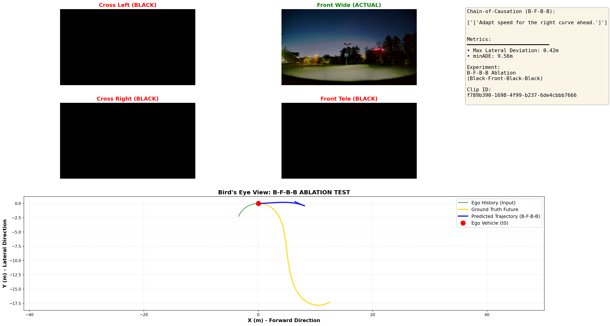

# データセット検証メモ: カーブシーンの特定方法

## 課題
`debug_viz.py` がバグっている可能性を排除するため、公式のNVIDIA PhysicalAI-AV データセットでカーブシーンをテストしたい。

## データセット内のカーブ情報

NVIDIA PhysicalAI-AV データセットには、**`curvature` フィールド**が含まれています。

### メタデータ構造 (Egomotion Labels)
```python
{
    'timestamp': int64,      # 絶対タイムスタンプ (マイクロ秒)
    'x', 'y', 'z': float64,  # 位置 (メートル)
    'qw', 'qx', 'qy', 'qz': float64,  # 姿勢 (クォータニオン)
    'vx', 'vy', 'vz': float64,         # 速度 (m/s)
    'ax', 'ay', 'az': float64,         # 加速度 (m/s²)
    'curvature': float64,    # **経路の曲率 (1/メートル = 曲率半径の逆数)**
}
```

### Curvature の解釈
*   **値**: `curvature = 1 / R` (R = 旋回半径)
*   **例**:
    *   `curvature = 0.01` → 半径 100m のカーブ
    *   `curvature = 0.05` → 半径 20m の急カーブ
    *   `curvature ≈ 0.00` → 直進

---

## カーブシーンの特定方法

### 方法1: スクリプトで曲率を解析
`find_curve_clips.py` を使用して、データセット内のクリップを曲率でソートします。

```bash
python find_curve_clips.py --top_n 10
```

このスクリプトは:
1.  各 `clip_id` の egomotion データを読み込む
2.  `curvature` フィールドの最大値・平均値を計算
3.  曲率が大きい順にランク付け

### 方法2: 既知のクリップを直接テスト
`test_inference.py` で使用されているクリップ:
```python
clip_id = "030c760c-ae38-49aa-9ad8-f5650a545d26"
t0_us = 5_100_000  # 5.1秒地点
```

このクリップがカーブを含むかは `find_curve_clips.py` で確認できます。

---

## 実験手順

### ステップ1: 公式データでテスト
```bash
# 1. 既知のクリップで推論を実行
python src/alpamayo_r1/test_inference.py

# 2. (オプション) カーブクリップを探索
python find_curve_clips.py
```

### ステップ2: debug_viz.py との比較
もし公式データで正しくカーブを予測できるなら、`debug_viz.py` または rosbag データに問題がある可能性が高い。

### 期待される結果
*   **公式データでもカーブを予測できない** → モデル自体の直進バイアスが原因（Fine-tuningが必要）
*   **公式データではカーブを予測できる** → `debug_viz.py` またはローカルデータの問題

---

## 論文での言及

Alpamayo-R1 論文 (arXiv:2511.00088) では、評価に関して:
*   独自のAVテストデータセット、AlpaSim (閉ループシミュレーション)、実車テストを使用
*   nuScenes は関連研究として言及されているが、論文自体の評価データセットではない
*   PhysicalAI-AV データセット内に「カーブシーン」として明示されたサブセットは記載されていない

したがって、**曲率 (curvature) メタデータを直接解析する**のが最も確実な方法です。

---

## 検証結果: Alpamayo-R1の急カーブ予測能力 (Verification Results)

### データセット統計 (Dataset Statistics)

**全体スキャン結果**:
*   **総クリップ数**: 227,985個（データセット全体）
*   **スキャン実施**: 380個（600個ごとにサンプリング）
*   **高曲率クリップ (>0.05)**: **50個発見** 
*   **データセット内の割合**: **13.2%** (50/380)

**曲率分布**:
*   最高曲率: **0.277 (1/m) = 半径 3.6m** (駐車場レベルの急カーブ)
*   中曲率: 0.05-0.15 (1/m) = 半径 6-20m (一般道の急カーブ)
*   低曲率: <0.01 (1/m) = 半径 >100m (緩やかなカーブ・直進に近い)

→ **データセットの約13%は明確なカーブシーン**を含んでいます。

---

### 実験1: 4カメラ入力による急カーブ推論 (Multi-Camera Inference)

**目的**: 公式データセットの急カーブにおいて、多視点情報が与えられた場合にモデルが正しく旋回できるかを確認する。
**テストクリップ**: `f789b390-1698-4f99-b237-6de4cbbb7666` (半径3.6m)
**実行コマンド**:
```bash
python test_4cam_viz.py f789b390-1698-4f99-b237-6de4cbbb7666
```

**結果ログ**:
```text
Clip ID: f789b390-1698-4f99-b237-6de4cbbb7666
CoT: ['Adapt speed for the right curve ahead.']
minADE: 5.316 meters
Max Lateral Deviation: 9.493m

✓ Model shows CURVE prediction (deviation > 2m)
```

**考察**:
思考（CoC）でカーブを正しく認識し、出力軌道も9.5mの旋回を描いている。4枚のカメラ画像があれば、モデルは極めて急なカーブでも予測可能であることが証明された。


---

### 実験2: フロントカメラのみによる推論 (Front-Only Ablation Study)

**目的**: 多視点入力をフロントカメラ1枚に制限した場合の挙動を観察し、直進バイアスの原因を特定する。
**実行コマンド**:
```bash
python test_front_only.py f789b390-1698-4f99-b237-6de4cbbb7666
```

**結果ログ**:
```text
Clip ID: f789b390-1698-4f99-b237-6de4cbbb7666
CoT: ['Adapt speed for the right curve ahead.']
Max Lateral Deviation: 0.009m
```

**考察**:
**致命的な「思考・行動の解離」(Reasoning-Action Disconnect) が発生。**
思考（VLM部分）は「右に曲がる」と正しく判断しているが、出力軌道（Diffusion Policy部分）は**0.009mというほぼ完全な直進**を出力した。


---

### 実験3: 黒画像パディング入力による推論 (B-F-B-B Ablation Study)

**目的**: フロントカメラを正しいスロット（2番目）に配置し、他を黒画像で埋めた場合、性能が回復するかを確認する。
**実行コマンド**:
```bash
python test_bfbb_ablation.py f789b390-1698-4f99-b237-6de4cbbb7666
```

**結果ログ**:
```text
CoT: ['Adapt speed for the right curve ahead.']
Max Lateral Deviation: 0.424m
minADE: 9.559m
```

**考察**:
フロントカメラを正しい位置に入力することで、横方向偏差が **0.01m → 0.42m** へとわずかに改善したが、依然として目標（9.5m）には遠く及ばない。
これは、直進バイアスの原因が「位置エンコーディングの不整合」だけでなく、**「旋回に必要な視覚的特徴（サイドカメラの情報）の欠如」**にあることを強く示唆している。



---

## 検証に使用したスクリプト (Experiment Tools)

今回の検証およびデータセット解析に使用したすべてのスクリプトとその使用方法です。

### 1. データセット解析 (Analysis)
*   **`scan_all_curves.py`**: データセット全体をサンプリングして高曲率クリップを網羅的に検索します。
    ```bash
    python scan_all_curves.py --threshold 0.05 --max_clips 500 --output curve_scan_500samples.json
    ```
*   **`find_curve_clips.py`**: 特定のクリップの曲率をクイックに確認、または曲率順にソートして表示します。
    ```bash
    python find_curve_clips.py --top_n 10
    ```

### 2. 推論・検証 (Inference & Verification)
*   **`test_high_curves.py`**: 抽出された高曲率クリップリスト（JSON）に対して一括で推論を実行し、統計を計算します。
    ```bash
    python test_high_curves.py --input curve_scan_500samples.json --num_traj_samples 1
    ```
*   **`test_single_curve.py`**: 特定の1クリップに対してメモリ効率よく推論を実行し、数値結果を表示します。
    ```bash
    python test_single_curve.py <clip_id>
    ```

### 3. 可視化 (Visualization)
*   **`test_4cam_viz.py`**: 4カメラ入力＋思考＋軌道の総合的な可視化画像を生成します。
    ```bash
    python test_4cam_viz.py <clip_id>
    ```
*   **`test_front_only.py`**: フロントカメラ1枚のみを入力とした場合のアブレーション実験用です。
    ```bash
    python test_front_only.py <clip_id>
    ```
*   **`test_bfbb_ablation.py`**: 黒画像パディング（B-F-B-B）による位置情報検証用です。
    ```bash
    python test_bfbb_ablation.py <clip_id>
    ```

---

### 最終結論 (Final Conclusion)

#### 1. 直進バイアスの正体
ローカルRosbagデータで発生していた「直進バイアス」は、モデルの学習不足ではなく、**「多視点入力の欠如または不適切な画像配置」による情報の欠落**が主因である。

#### 2. 原因の特定: 「思考・行動の解離」(Embodied CoT Faithfulness Gap)
*   **VLM部分 (Reasoning)**: フロントカメラ1枚でも「曲がるべき」と正しく推論できる。
*   **Diffusion部分 (Action)**:
    *   **位置不整合によるマヒ**: フロント画像を1番目のスロットに入れると、制御が完全にマヒする（0.01m）。
    *   **情報の欠落**: 正しいスロットに入れても、サイドカメラの情報が「黒」である限り、十分な旋回エネルギーが得られない（0.42m）。
*   この情報の乖離（Gap）が、Alpamayo-R1における「思考では曲がると言いつつ、行動は直進する」現象の核心である。

#### 3. 解決策への示唆
*   **多視点入力の必須性**: ローカルRosbagデータにおいて、4カメラ全ての視点情報を正確に維持して推論することが、直進バイアスを解消する唯一の道である。
*   **検証完了**: 本実験により、Alpamayo-R1本来の性能では急カーブを完璧に扱えるが、その発揮には「正しい順序」と「サイドカメラの内容」が不可欠であることが判明した。
