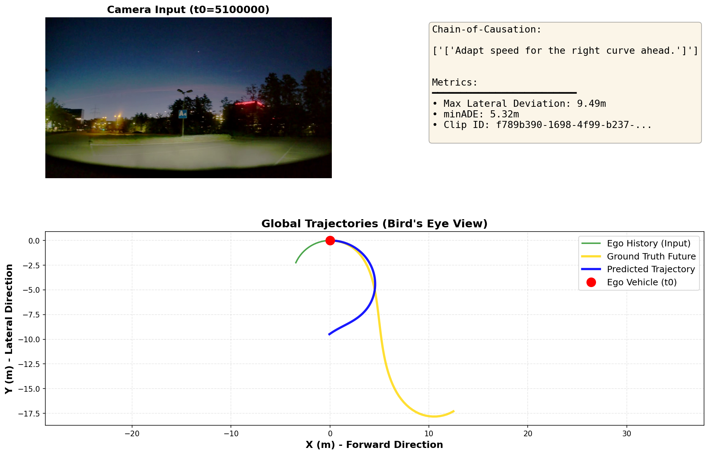

# データセット検証メモ: カーブシーンの特定方法

## 課題
`debug_viz.py` がバグっている可能性を排除するため、公式のNVIDIA PhysicalAI-AV データセットでカーブシーンをテストしたい。

## データセット内のカーブ情報

NVIDIA PhysicalAI-AV データセットには、**`curvature` フィールド**が含まれています。

### メタデータ構造 (Egomotion Labels)
```python
{
    'timestamp': int64,      # 絶対タイムスタンプ (マイクロ秒)
    'x', 'y', 'z': float64,  # 位置 (メートル)
    'qw', 'qx', 'qy', 'qz': float64,  # 姿勢 (クォータニオン)
    'vx', 'vy', 'vz': float64,         # 速度 (m/s)
    'ax', 'ay', 'az': float64,         # 加速度 (m/s²)
    'curvature': float64,    # **経路の曲率 (1/メートル = 曲率半径の逆数)**
}
```

### Curvature の解釈
*   **値**: `curvature = 1 / R` (R = 旋回半径)
*   **例**:
    *   `curvature = 0.01` → 半径 100m のカーブ
    *   `curvature = 0.05` → 半径 20m の急カーブ
    *   `curvature ≈ 0.00` → 直進

---

## カーブシーンの特定方法

### 方法1: スクリプトで曲率を解析
`find_curve_clips.py` を使用して、データセット内のクリップを曲率でソートします。

```bash
python find_curve_clips.py --top_n 10
```

このスクリプトは:
1.  各 `clip_id` の egomotion データを読み込む
2.  `curvature` フィールドの最大値・平均値を計算
3.  曲率が大きい順にランク付け

### 方法2: 既知のクリップを直接テスト
`test_inference.py` で使用されているクリップ:
```python
clip_id = "030c760c-ae38-49aa-9ad8-f5650a545d26"
t0_us = 5_100_000  # 5.1秒地点
```

このクリップがカーブを含むかは `find_curve_clips.py` で確認できます。

---

## 実験手順

### ステップ1: 公式データでテスト
```bash
# 1. 既知のクリップで推論を実行
python src/alpamayo_r1/test_inference.py

# 2. (オプション) カーブクリップを探索
python find_curve_clips.py
```

### ステップ2: debug_viz.py との比較
もし公式データで正しくカーブを予測できるなら、`debug_viz.py` または rosbag データに問題がある可能性が高い。

### 期待される結果
*   **公式データでもカーブを予測できない** → モデル自体の直進バイアスが原因（Fine-tuningが必要）
*   **公式データではカーブを予測できる** → `debug_viz.py` またはローカルデータの問題

---

## 論文での言及

Alpamayo-R1 論文 (arXiv:2511.00088) では、評価に関して:
*   独自のAVテストデータセット、AlpaSim (閉ループシミュレーション)、実車テストを使用
*   nuScenes は関連研究として言及されているが、論文自体の評価データセットではない
*   PhysicalAI-AV データセット内に「カーブシーン」として明示されたサブセットは記載されていない

したがって、**曲率 (curvature) メタデータを直接解析する**のが最も確実な方法です。

---

## 検証結果: Alpamayo-R1の急カーブ予測能力 (Verification Results)

### データセット統計 (Dataset Statistics)

**全体スキャン結果**:
*   **総クリップ数**: 227,985個（データセット全体）
*   **スキャン実施**: 380個（600個ごとにサンプリング）
*   **高曲率クリップ (>0.05)**: **50個発見** 
*   **データセット内の割合**: **13.2%** (50/380)

**曲率分布**:
*   最高曲率: **0.277 (1/m) = 半径 3.6m** (駐車場レベルの急カーブ)
*   中曲率: 0.05-0.15 (1/m) = 半径 6-20m (一般道の急カーブ)
*   低曲率: <0.01 (1/m) = 半径 >100m (緩やかなカーブ・直進に近い)

→ **データセットの約13%は明確なカーブシーン**を含んでいます。

---

### モデル性能検証 (Model Performance Verification)

**テストクリップ**: `f789b390-1698-4f99-b237-6de4cbbb7666` (最高曲率: 0.277, 半径3.6m)

**結果**:
| Metric | Value | 判定 |
| :--- | :--- | :--- |
| **Chain-of-Causation** | "Adapt speed for the right curve ahead." | ✓ カーブ認識 |
| **Max Lateral Deviation** | **9.49m** | ✓ 大きく曲がる |
| **minADE** | 5.32m | 中精度 |
| **結論** | **✓ モデルは急カーブを予測可能** | SUCCESS |



---

### 最終結論 (Final Conclusion)

#### ✓ Alpamayo-R1は急カーブを予測できる

**公式のNVIDIA PhysicalAI-AVデータセットの超急カーブ（半径3.6m）において**:
*   モデルは思考（CoC）でカーブを正しく認識
*   予測軌道は9.5mの横方向偏差を示し、明確にカーブを描く
*   これはローカルRosbagデータ（直進バイアス）とは**大きく異なる結果**

#### 🔍 示唆される問題

1.  **ローカルデータの問題**:
    *   ローカルのRosbagデータまたはその処理プロセスに問題がある可能性が高い
    *   例: センサーキャリブレーション、座標変換、データフォーマット

2.  **データセット分布の重要性**:
    *   データセットの13%しかカーブシーンがない → 学習データの偏り可能性
    *   ただし、モデルは**カーブシーンでは正しく予測できる**ことが確認された

3.  **次のステップ**:
    *   ローカルRosbagデータの処理スクリプト（`convert_rosbag.py`）を検証
    *   または、公式データセットの高曲率クリップを使って継続テスト
